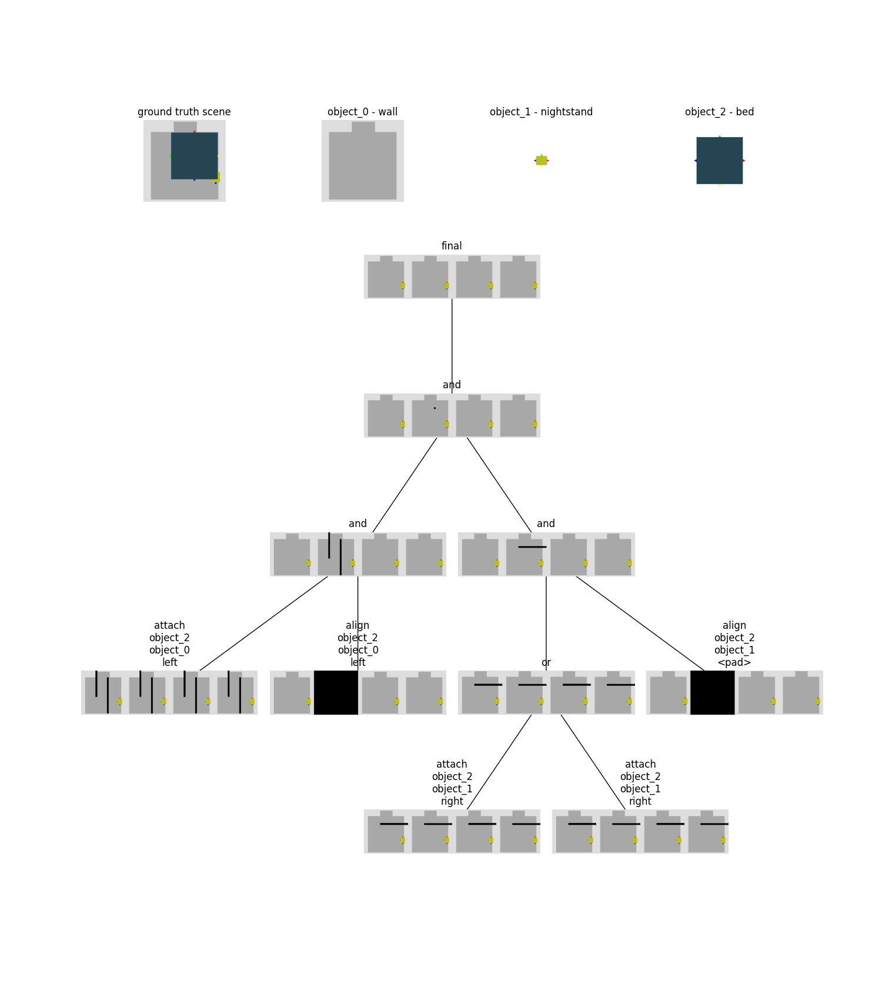

# Pertinent Info on Program Extraction 
The overal procedure 
```
program = Program()
for reference_object in the room:
    subprogram = Program()
    distance, sides = reference_object.distance(query_object)
    if distance is within threshold:
        for side in sides: 
            subprogram |= relevant constraint with side as argument
    
    if subprogram not null and orientation constraint applicable:
        orientation_constraint = relevant orientation constraint 
        subprogram &= orientation_constraint
    
    program &= subprogram

return program
```
Sides is returned in the case that there are multiple possible sides the query_object could be on (significant overlap between the two objects) 

To determine which side an object falls on in relation to another, the following procedure is used. A list of previous procedures alongside the reason they aren't used is also included just in case one of them had good ideas. 

## Current
For each side in the reference_object, calculate how much area the query_object covers in the side's view. The idea is to project the side in the direction of the normal to the edge of the room and ask how much area of the query_object overlaps with this quad (this is not how it is actually implemented). The side with highest area wins. 

(edit: this was changed to the highest side with the highest parallel length, cases where there is a tiny sliver but very long (shown below))

## Previous 
- OBB to OBB distance is found by finding the minimum distance between each of the 4 individual line segments of each bounding box. The side with the smallest distance is returned as the side the query_object is 
    - It is possible for two line segments on the reference_object to have the same minimum distance to the query_object, especially if the two are axis aligned (often the case) and the closest point is a corner shared between the two sides. The wrong direction is often returned in this case
- For each bounding box calculate an angular bin. This angular bin is the angle from the bottom right corner to the top right, top right to top left, top left to bottom left, and bottom left to bottom right. With this angular bin, given an arbitrary point can calculate which angular slice it falls under and classify the side this way.  
    - In the case of intersections between two objects where there are often two closest points (both of zero distance because of intersection), only one of them can be chosen. Tried summing the vectors (point of intersection - object center) and using that vector + center as classification point to varying levels of success. 
- Treat each line segment as a linear classifier and linearly classify the 4 points of the query_object. Weigh the scores based on the projected distance between the point and the plane. 
    - Since the line segment is treated as a linear classifier, it does not encapsulate information about the length of the actual line segment. In the example below, this method results in an inference of the `up` direction instead of `left`. 


# Collection of Edge Cases 
After the final mask is generated, a verification procedure is applied ensuring that each possible placement results in no intersections between other objects and no placements outside the room. 

## Room 0 
In the following two examples points are predicted (not a null program), but they are disqualified because the possible placements would result in an intersections with other objects, which is what happens in the ground truth 



## Room 1
In this example, conceptually everything seems correct. The wardrobe should be both attached to the wall and attached to the nightstand on the left side. The reason why there is no intersection between the two strips of these final masks is because the constraint solve assumes that there will be no intersections and out of bounds placements. 

For the attachment to the nightstand (right most node) all of the possible locations are guaranteed to to not intersect with the nightstand. This disagrees with the ground truth while the attachment of the wardrobe to the wall agrees. 

This could be fixed perhaps with some kind of forgiveness, like allow intersections between objects to a certain extent. 


## Room 124
This is just a hard room that breaks a lot of the current extraction process 


Take the following subsampled room where we are trying to place a bed. We try to attach the bed to the wall and attach it to the backside of the wardrobe. Attachment to the wall is represented by the left child of the final and node and attachment to the backside of the wardrobe is represented by the right child. Attachment to the backside of the wardrobe assumes no intersections which is why combining the two results in no valid placements. 

Perhaps if there is a significant enough intersection between the two objects, just don't infer a constraint? 


The same thing happens in the following example. Attachment to the backside of the wardrobe, because it contains no valid placements, results in no valid placements in the final mask. 


## Room 19
This bug is a little more subtle. The error is that the attachment of the bed to the nightstand should be on the nightstand's left side instead of the backside. The inferred side is the backside because I look at the distance between each individual line segment and if the distance is smaller than the current minimum, I calculate its "score" based on the method described above. It's hard to tell, but in this case the nightstand's left side does not actually intersect with the bed's right side or back side, so its distance to the bed is calculated as above 0. It is never flagged to be considered as a possible "correct" side so its "score" is never calculated and used. 

