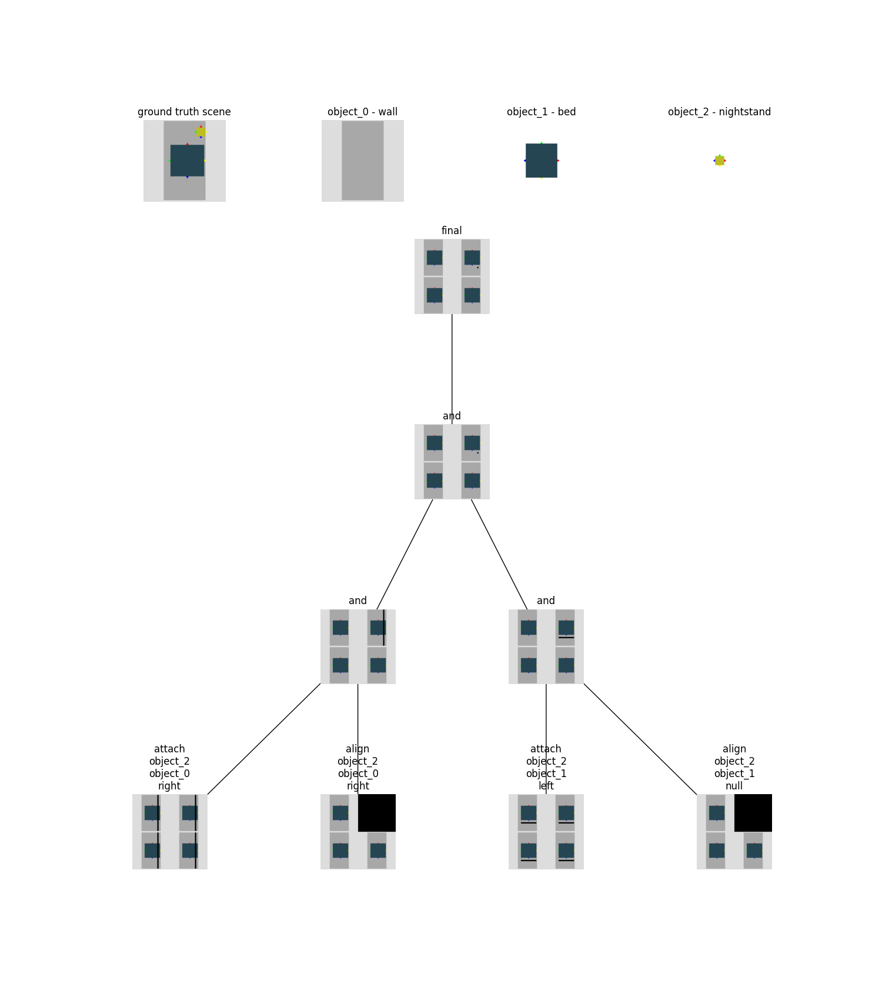
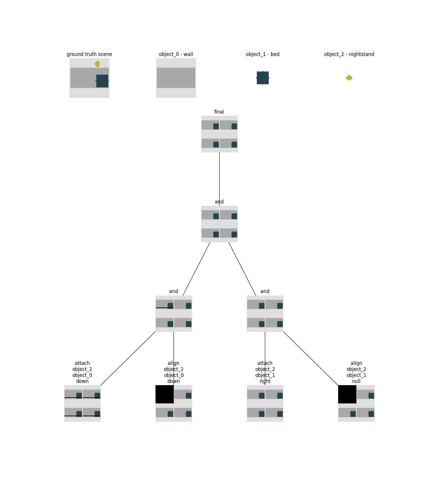

# Experiment Descriptions 
The following experiments are isolated to a bed + nightstand context 

1. Shift the bed across the room and predict nightstand placements at each step 
2. Alter the size of the bed and predict its placement in the room at each size value 
3. Combine experiments 1 and 2 by shifting the bed across the room and predicting nightstand placements for each incremental size of the bed. 

All 3 of the above experiments are repeated with different room rotations 

(Ignore the top left image for all visualizations)

(Also sorry, it's a lot to scroll through)

## Experiment 1 Results (Bed shifting)
Shown also are the logits for predicting which side of the bed the nightstand will appear on 

### No room rotation


```
logit: 3.47367525100708, vocab: right
logit: -7.572005271911621, vocab: up
logit: 3.915738105773926, vocab: left
logit: -5.783087253570557, vocab: down
logit: -6.7952880859375, vocab: null
```


```
logit: 3.4656686782836914, vocab: right
logit: -8.00473690032959, vocab: up
logit: 3.8296313285827637, vocab: left
logit: -5.49824857711792, vocab: down
logit: -6.351992607116699, vocab: null
```


```
logit: 3.380284070968628, vocab: right
logit: -7.5972771644592285, vocab: up
logit: 4.072733402252197, vocab: left
logit: -6.034188270568848, vocab: down
logit: -7.095845699310303, vocab: null
```


```
logit: 3.24699330329895, vocab: right
logit: -6.705238342285156, vocab: up
logit: 3.5001323223114014, vocab: left
logit: -5.440253734588623, vocab: down
logit: -6.764425754547119, vocab: null
```


```
logit: 3.463308811187744, vocab: right
logit: -7.65548849105835, vocab: up
logit: 3.7461516857147217, vocab: left
logit: -5.453254222869873, vocab: down
logit: -6.797907829284668, vocab: null
```


```
logit: 3.549915075302124, vocab: right
logit: -7.067848205566406, vocab: up
logit: 3.649623155593872, vocab: left
logit: -5.816465854644775, vocab: down
logit: -6.876861572265625, vocab: null
```


```
logit: 3.1701595783233643, vocab: right
logit: -7.32511043548584, vocab: up
logit: 3.560872793197632, vocab: left
logit: -5.215178966522217, vocab: down
logit: -6.324440956115723, vocab: null
```


```
logit: 3.798814058303833, vocab: right
logit: -7.906073570251465, vocab: up
logit: 4.002410888671875, vocab: left
logit: -6.1317620277404785, vocab: down
logit: -6.891155242919922, vocab: null
```


```
logit: 3.2472198009490967, vocab: right
logit: -5.848867416381836, vocab: up
logit: 3.081571102142334, vocab: left
logit: -4.921895503997803, vocab: down
logit: -6.783134460449219, vocab: null
```


(The logits should not be this close)
```
logit: 3.4822404384613037, vocab: right
logit: -7.0103840827941895, vocab: up
logit: 3.4618747234344482, vocab: left
logit: -5.39540958404541, vocab: down
logit: -6.6241936683654785, vocab: null
```


```
logit: 3.2198500633239746, vocab: right
logit: -5.929515838623047, vocab: up
logit: 2.942519187927246, vocab: left
logit: -4.685329437255859, vocab: down
logit: -6.68990421295166, vocab: null
```

### With room rotation

This is repeated with the same room rotated. I also report the `attach` vs `reachable_by_arm` logits in this case.


```
logit: 3.852621555328369, vocab: attach
logit: 4.333281517028809, vocab: reachable_by_arm
logit: -7.177051544189453, vocab: align
logit: -10.538400650024414, vocab: face
logit: -10.177441596984863, vocab: <sos>

logit: 3.3691210746765137, vocab: right
logit: -7.558647155761719, vocab: up
logit: 4.010644435882568, vocab: left
logit: -5.90350866317749, vocab: down
logit: -6.805798530578613, vocab: null
```


```
logit: 7.968932628631592, vocab: attach
logit: 1.5931320190429688, vocab: reachable_by_arm
logit: -16.692750930786133, vocab: align
logit: -7.6312785148620605, vocab: face
logit: -14.270997047424316, vocab: <sos>

logit: 7.215183258056641, vocab: right
logit: -8.211820602416992, vocab: up
logit: -1.308773398399353, vocab: left
logit: -8.62617015838623, vocab: down
logit: -6.011929035186768, vocab: null
```


```
logit: 4.51864767074585, vocab: attach
logit: 3.2167112827301025, vocab: reachable_by_arm
logit: -7.621645450592041, vocab: align
logit: -10.682723999023438, vocab: face
logit: -10.686671257019043, vocab: <sos>

logit: 3.2455995082855225, vocab: right
logit: -8.080198287963867, vocab: up
logit: 3.9291555881500244, vocab: left
logit: -5.710178375244141, vocab: down
logit: -5.895814895629883, vocab: null
```


```
logit: 4.217878818511963, vocab: attach
logit: 3.783452033996582, vocab: reachable_by_arm
logit: -8.37987995147705, vocab: align
logit: -8.771936416625977, vocab: face
logit: -8.963615417480469, vocab: <sos>

logit: 3.463250160217285, vocab: right
logit: -7.309096813201904, vocab: up
logit: 3.5817222595214844, vocab: left
logit: -5.318580150604248, vocab: down
logit: -6.477692127227783, vocab: null
```


```
logit: 6.798640727996826, vocab: attach
logit: -0.8964105844497681, vocab: reachable_by_arm
logit: -9.200887680053711, vocab: align
logit: -8.347136497497559, vocab: face
logit: -11.561563491821289, vocab: <sos>

logit: 3.4409079551696777, vocab: right
logit: -7.3834028244018555, vocab: up
logit: 3.623756170272827, vocab: left
logit: -5.636643886566162, vocab: down
logit: -5.911684036254883, vocab: null
```


```
logit: 6.150659084320068, vocab: attach
logit: 0.24991191923618317, vocab: reachable_by_arm
logit: -8.99161434173584, vocab: align
logit: -8.021644592285156, vocab: face
logit: -10.818755149841309, vocab: <sos>

logit: 3.2812256813049316, vocab: right
logit: -6.988520622253418, vocab: up
logit: 3.418715000152588, vocab: left
logit: -5.193558692932129, vocab: down
logit: -5.922928810119629, vocab: null
```


```
logit: 4.289534091949463, vocab: attach
logit: 3.0562283992767334, vocab: reachable_by_arm
logit: -7.6741485595703125, vocab: align
logit: -8.293025016784668, vocab: face
logit: -8.908171653747559, vocab: <sos>

logit: 3.238018274307251, vocab: right
logit: -6.275834083557129, vocab: up
logit: 3.0935909748077393, vocab: left
logit: -4.925471782684326, vocab: down
logit: -6.03275203704834, vocab: null
```


```
logit: 4.59213399887085, vocab: attach
logit: 3.6344945430755615, vocab: reachable_by_arm
logit: -8.481256484985352, vocab: align
logit: -9.665771484375, vocab: face
logit: -9.84924602508545, vocab: <sos>

logit: 3.285165786743164, vocab: right
logit: -7.0943474769592285, vocab: up
logit: 3.4446771144866943, vocab: left
logit: -5.0373029708862305, vocab: down
logit: -6.030130386352539, vocab: null
```


```
logit: 5.39103364944458, vocab: attach
logit: 1.585206389427185, vocab: reachable_by_arm
logit: -8.688074111938477, vocab: align
logit: -7.884620666503906, vocab: face
logit: -9.524407386779785, vocab: <sos>

logit: 3.268588066101074, vocab: right
logit: -6.654545783996582, vocab: up
logit: 3.127406358718872, vocab: left
logit: -4.654012680053711, vocab: down
logit: -6.146190643310547, vocab: null
```


```
logit: 4.249463081359863, vocab: attach
logit: 2.7498605251312256, vocab: reachable_by_arm
logit: -7.681085586547852, vocab: align
logit: -7.94592809677124, vocab: face
logit: -8.486292839050293, vocab: <sos>

logit: 3.1986000537872314, vocab: right
logit: -6.589029312133789, vocab: up
logit: 3.166733503341675, vocab: left
logit: -4.740201473236084, vocab: down
logit: -6.095188140869141, vocab: null
```


```
logit: 4.009964466094971, vocab: attach
logit: 4.234711647033691, vocab: reachable_by_arm
logit: -7.602575778961182, vocab: align
logit: -10.091434478759766, vocab: face
logit: -9.978741645812988, vocab: <sos>

logit: 3.4236392974853516, vocab: right
logit: -6.843376159667969, vocab: up
logit: 3.4761531352996826, vocab: left
logit: -5.455045223236084, vocab: down
logit: -6.409905910491943, vocab: null
```

Although the initial shifting of the bed looked promising, it seems that model is not fully utilizing information about the floor plan and space to reason about its predictions 

## Experiment 2 Results (Bed resize)
Shown is placement of bed and then placement of nightstand with increasing sizes of the bed. 

### No room rotation

30% size

Note that at this size it predicts the right side of the bed 


```
logit: 3.5393576622009277, vocab: right
logit: -6.287558078765869, vocab: up
logit: 3.496732473373413, vocab: left
logit: -5.811542987823486, vocab: down
logit: -6.829760551452637, vocab: null
```

40% size


```
logit: 3.682617664337158, vocab: right
logit: -6.5563273429870605, vocab: up
logit: 3.7210214138031006, vocab: left
logit: -6.675556659698486, vocab: down
logit: -6.973623752593994, vocab: null
```

50% size

This one is strange, my guess is that there are examples of beds at this specific size in the middle of the room in the training set. 


```
logit: 5.020986080169678, vocab: attach
logit: -13.577832221984863, vocab: reachable_by_arm
logit: 5.792884826660156, vocab: align
logit: -7.143665313720703, vocab: face
logit: -14.114161491394043, vocab: <sos>

logit: -6.2925872802734375, vocab: right
logit: -2.5231845378875732, vocab: up
logit: -6.8601765632629395, vocab: left
logit: -5.631095886230469, vocab: down
logit: 10.862408638000488, vocab: null
```


Note that even though the bed is not attached to a wall, the program predicted still attempts to attach the nightstand to the wall and bed 

Logits not reported for some of the examples below because nothing of note happens  

60% size


70% size


80% size


90% size




### Room rotation

30% size
Interesting that it now specifies the corner in this orientation 


```
logit: 3.7206475734710693, vocab: right
logit: -8.244156837463379, vocab: up
logit: 3.8982646465301514, vocab: left
logit: -5.420029163360596, vocab: down
logit: -6.920505523681641, vocab: null
```

40% size


```
logit: 3.5434646606445312, vocab: right
logit: -7.285064697265625, vocab: up
logit: 3.751094341278076, vocab: left
logit: -5.929365158081055, vocab: down
logit: -6.735522270202637, vocab: null
```

50% size

Interesting that this happens again


```
logit: 3.310420513153076, vocab: right
logit: -7.159155368804932, vocab: up
logit: 3.3124334812164307, vocab: left
logit: -4.856514930725098, vocab: down
logit: -6.194471836090088, vocab: null
```

60% size


70% size

Incorrect prediction 




```
logit: 3.708038568496704, vocab: right
logit: -7.6031107902526855, vocab: up
logit: 3.552382230758667, vocab: left
logit: -5.444429874420166, vocab: down
logit: -6.53810453414917, vocab: null
```

80% size
`reachable_by_arm` here for some reason on incorrect side 


```
logit: -0.8634141683578491, vocab: attach
logit: 7.137844562530518, vocab: reachable_by_arm
logit: -6.612261772155762, vocab: align
logit: -9.703435897827148, vocab: face
logit: -12.811726570129395, vocab: <sos>

logit: 3.173067092895508, vocab: right
logit: -6.096098899841309, vocab: up
logit: 3.1941754817962646, vocab: left
logit: -4.3971099853515625, vocab: down
logit: -7.2906813621521, vocab: null
```

90% size


```
logit: 3.4369821548461914, vocab: right
logit: -6.66986083984375, vocab: up
logit: 3.462935447692871, vocab: left
logit: -5.782116413116455, vocab: down
logit: -6.085571765899658, vocab: null
```

## Experiment 3 Results (Bed resize and shift)
I've included these results as gifs because they're just a lot to go through. Generally the same conclusion holds for these objects as well that the model is randomly guessing left or right. 

No rotation
https://user-images.githubusercontent.com/71151378/218005770-51f37fd0-f691-4f4c-9f1f-8bc7fcfb68bd.mp4

Rotation 
https://user-images.githubusercontent.com/71151378/218005807-4a0dc3d0-4421-437b-bb6b-cf0b20fee937.mp4


# Conclusions / Thoughts
- I think the model would benefit from some kind of data augmentation with the introduction of noise to the data. I think noise in the form of slight object size, position, and orientation perterbations would help the model generalize. It seems that specific sizes of the bed are associated with specific programs, and this noise might prevent that. Also random rotations of the room might help as well. 

- The model seems capable of reasoning about the floor space to a certain extent, but is severely limited. The logits seem to indicate the model is really just guessing whether the right or left side is correct 
 
- I have some ideas for changing the object encoding. 
    - I think it's really hard to come up with some kind of global room wide encoding/feature space that contains all of the pertinent information that the network would need to use to predict these programs. It might be easier to encode how much empty space is available on each of the 4 sides of an object's bounding box and add that to the encoding. This way the network won't have to do arithmetic to figure out which side of an object contains free space. 
    - The wall 
- 
