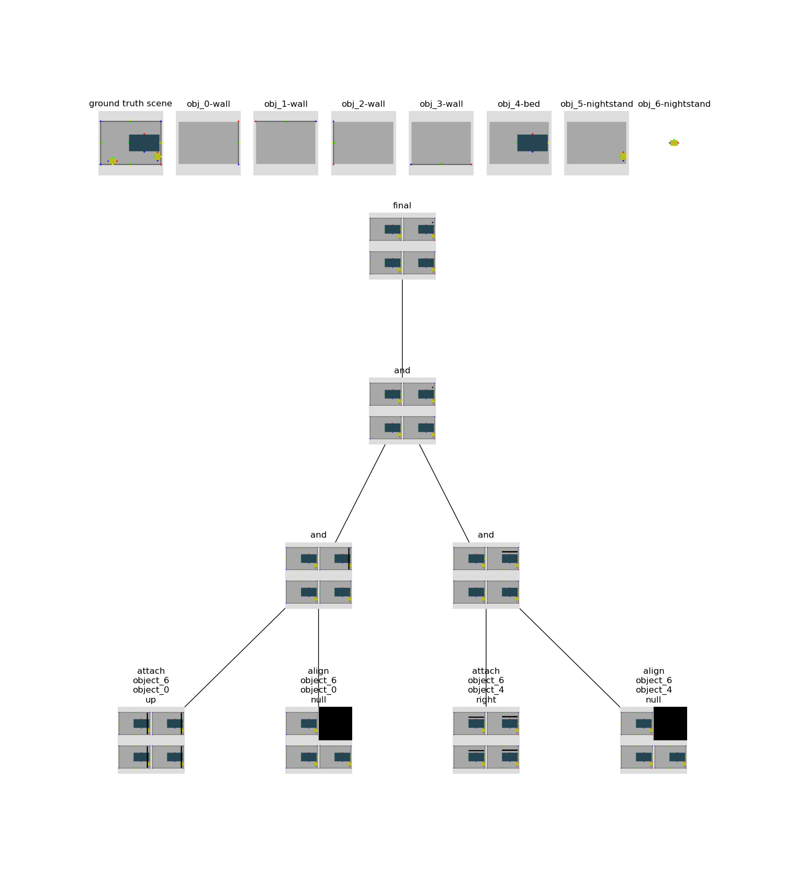
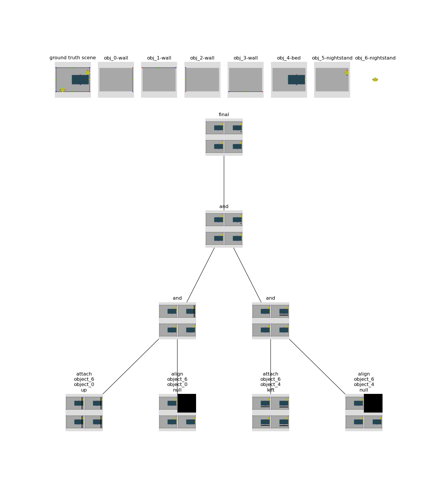
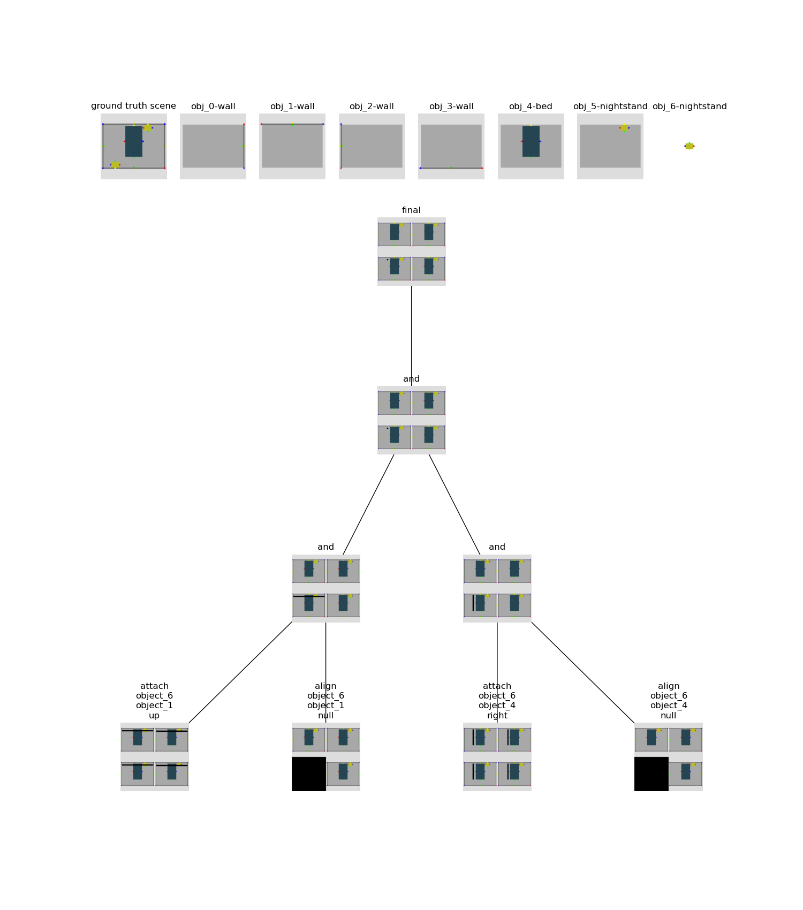
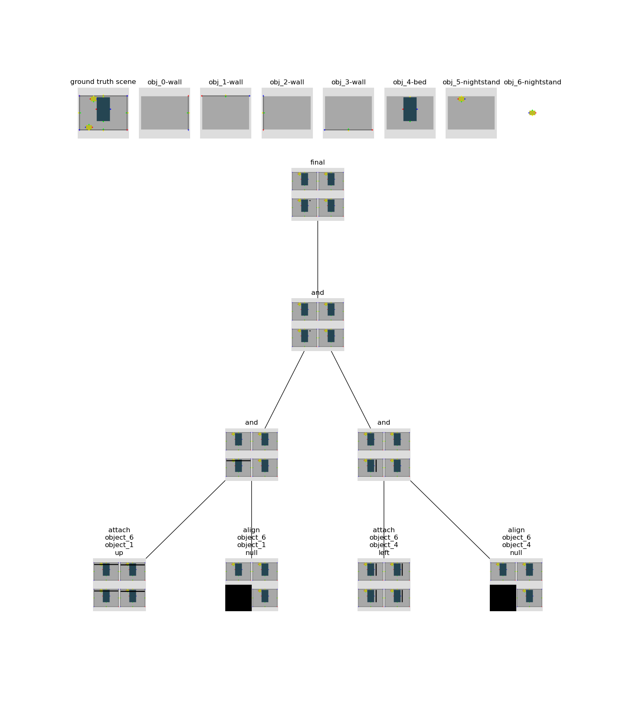
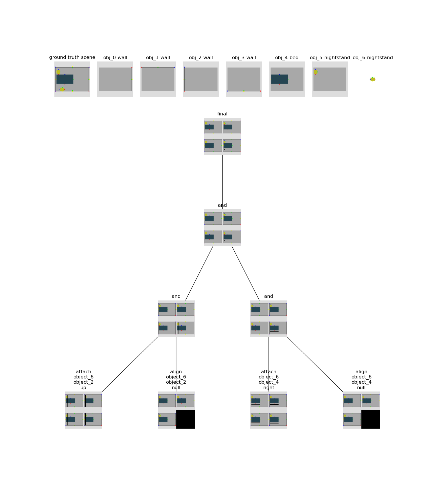
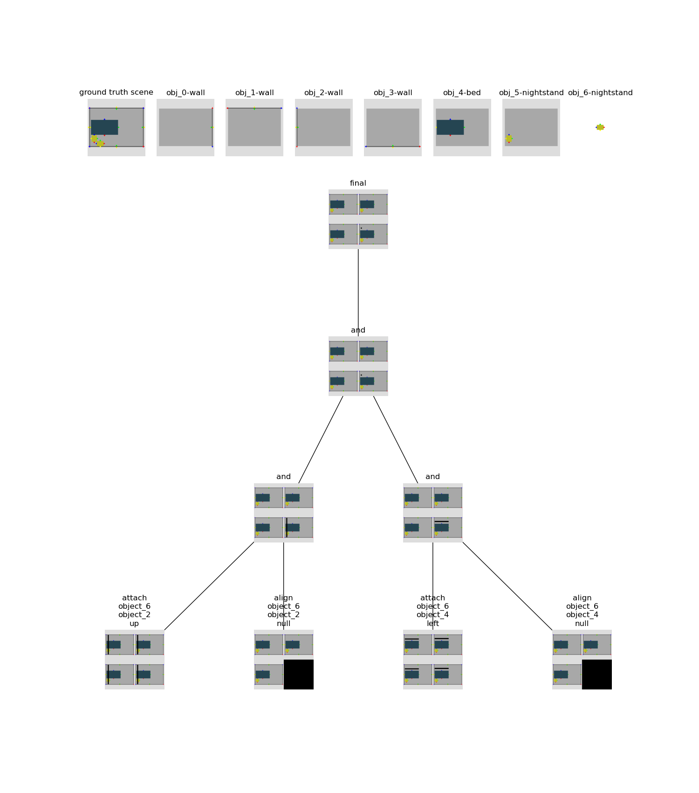
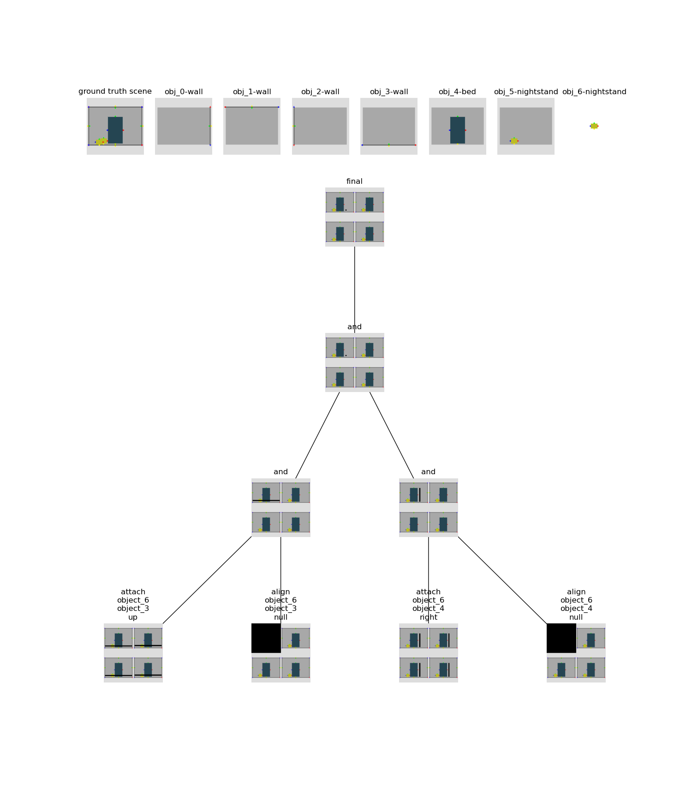
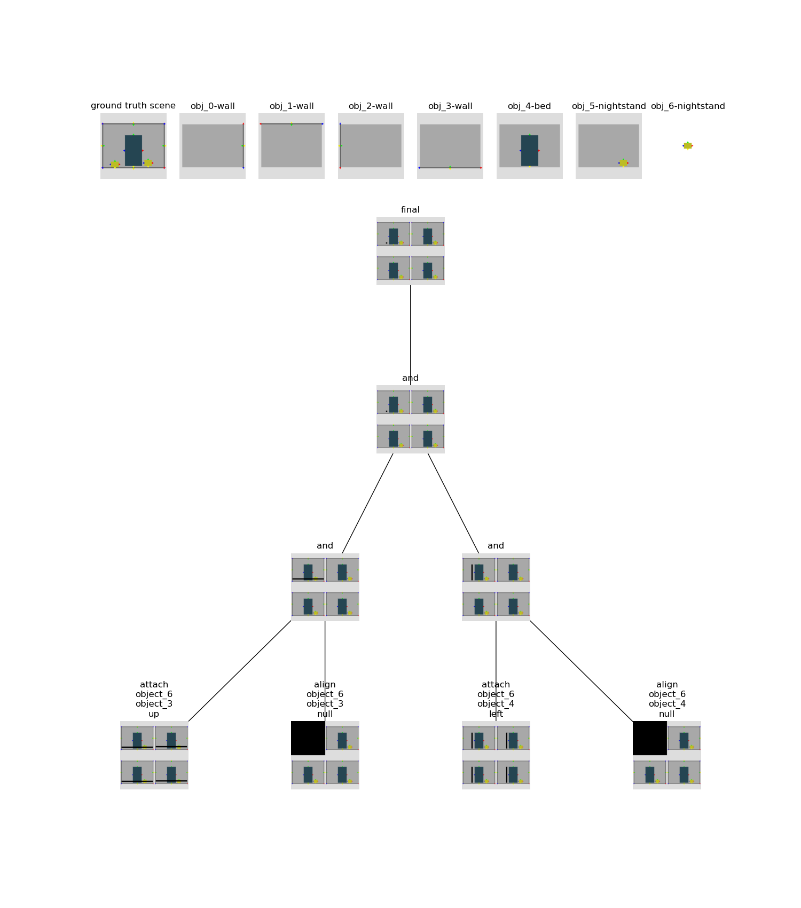

# Edge Pairwise Feature Added to Input Signal 
Implemented an addition to the multiheaded attention mechanism that includes pairwise features. Results shown below. The pairwise features are just direction that has an embedding. 

## Wall 0
### Nightstand on Bed Left 


```
logit: 6.342772960662842, percent: 0.99959796667099, vocab: right
logit: -4.3941969871521, percent: 2.1717936760978773e-05, vocab: up
logit: -1.8140922784805298, percent: 0.0002866446739062667, vocab: left
logit: -4.119104385375977, percent: 2.859496271412354e-05, vocab: down
logit: -3.297032117843628, percent: 6.505959026981145e-05, vocab: null
```

### Nightstand on Bed Right 


```
logit: -2.2284204959869385, percent: 0.0002209019148722291, vocab: right
logit: -3.711566686630249, percent: 5.0127619033446535e-05, vocab: up
logit: 6.188915252685547, percent: 0.9995438456535339, vocab: left
logit: -3.818838357925415, percent: 4.5028737076791e-05, vocab: down
logit: -2.6845109462738037, percent: 0.00013999796647112817, vocab: null
```

## Wall 1
### Nightstand on Bed Left 


```
logit: 6.429123878479004, percent: 0.9996285438537598, vocab: right
logit: -4.528092861175537, percent: 1.7425292753614485e-05, vocab: up
logit: -1.7750049829483032, percent: 0.0002734202134888619, vocab: left
logit: -4.239903450012207, percent: 2.324550223420374e-05, vocab: down
logit: -3.3359293937683105, percent: 5.7402408856432885e-05, vocab: null

```

### Nightstand on Bed Right 


```
logit: -1.946149468421936, percent: 0.0001973248436115682, vocab: right
logit: -3.8702926635742188, percent: 2.8809594368794933e-05, vocab: up
logit: 6.584205627441406, percent: 0.9996962547302246, vocab: left
logit: -3.9811601638793945, percent: 2.578623934823554e-05, vocab: down
logit: -3.2834365367889404, percent: 5.180902371648699e-05, vocab: null
```

## Wall 2
### Nightstand on Bed Left 


```
logit: 6.255426406860352, percent: 0.9995904564857483, vocab: right
logit: -4.350907325744629, percent: 2.4748558644205332e-05, vocab: up
logit: -1.9827101230621338, percent: 0.0002642682520672679, vocab: left
logit: -4.137131214141846, percent: 3.064727570745163e-05, vocab: down
logit: -3.0612425804138184, percent: 8.987604087451473e-05, vocab: null
```

### Nightstand on Bed Right 
 

```
logit: -1.9678428173065186, percent: 0.00020440474327187985, vocab: right
logit: -3.8435561656951904, percent: 3.1324128940468654e-05, vocab: up
logit: 6.527245998382568, percent: 0.9996801614761353, vocab: left
logit: -3.9918553829193115, percent: 2.700682307477109e-05, vocab: down
logit: -3.2440223693847656, percent: 5.704964496544562e-05, vocab: null
```

## Wall 3
### Nightstand on Bed Left 


```
logit: 6.44919490814209, percent: 0.9996153116226196, vocab: right
logit: -4.380702495574951, percent: 1.9791032173088752e-05, vocab: up
logit: -1.7043485641479492, percent: 0.0002876033540815115, vocab: left
logit: -4.156442165374756, percent: 2.4766432034084573e-05, vocab: down
logit: -3.4068214893341064, percent: 5.2410639909794554e-05, vocab: null
```

### Nightstand on Bed Right 


```
logit: -1.527353048324585, percent: 0.00024710112484171987, vocab: right
logit: -4.062914848327637, percent: 1.957466156454757e-05, vocab: up
logit: 6.778039455413818, percent: 0.9996793270111084, vocab: left
logit: -4.165029525756836, percent: 1.767445428413339e-05, vocab: down
logit: -3.443763494491577, percent: 3.6357014323584735e-05, vocab: null
```