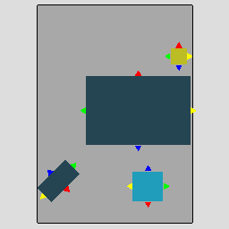
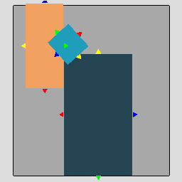

# Program Extraction + Filtering

Procedure the same as [previously](../7-19-22/program_extraction.md) except for few changes. 

 * Scaling attach minimum distance by the object size 
    * `MAX_ALLOWED_ATTACH_DISTANCE = 0.1 * magnitude(object dimensions)`
 * Wall constraints are found iterating through all walls and finding the minimum distance from the object to the wall segment. If the distance is less than `MAX_ALLOWED_ATTACH_DISTANCE` add an `attach` constraint in the direction of the wall segment. Only one count per direction is allowed. 

For walls, do not consider the overall appearance and only remove the constraint if the occurence metric is `< 0.1`

# Bed
<table>
<tr>
<th>Constraints</th>
<th>Removed Constraints</th>
<th>Remaing Constraints</th>
</tr>

<tr>

<td>

```
bed attach to nightstand's right side | occurrence: 0.40258557902403497
bed attach to nightstand's left side | occurrence: 0.41314639475600873
bed attach to nightstand's top side | occurrence: 0.03932993445010925
bed attach to nightstand's bottom side | occurrence: 0.02530954115076475
bed attach to nightstand's  side | occurrence: 0.8803714493809177

bed attach to chair's bottom side | occurrence: 0.08121827411167512
bed attach to chair's right side | occurrence: 0.08798646362098139
bed attach to chair's top side | occurrence: 0.050761421319796954
bed attach to chair's left side | occurrence: 0.0727580372250423
bed attach to chair's  side | occurrence: 0.2927241962774958

bed attach to wardrobe's top side | occurrence: 0.09306625577812018
bed attach to wardrobe's left side | occurrence: 0.012634822804314329
bed attach to wardrobe's bottom side | occurrence: 0.005855161787365178
bed attach to wardrobe's right side | occurrence: 0.01201848998459168
bed attach to wardrobe's  side | occurrence: 0.12357473035439137

bed attach to desk's right side | occurrence: 0.18562874251497005
bed attach to desk's top side | occurrence: 0.12874251497005987
bed attach to desk's left side | occurrence: 0.20958083832335328
bed attach to desk's bottom side | occurrence: 0.011976047904191617
bed attach to desk's  side | occurrence: 0.5359281437125748

bed attach to bed's bottom side | occurrence: 0.05
bed attach to bed's left side | occurrence: 0.25
bed attach to bed's top side | occurrence: 0.15
bed attach to bed's  side | occurrence: 0.45

bed reachable by arm from chair's bottom side | occurrence: 0.20473773265651438
bed reachable by arm from chair's left side | occurrence: 0.2233502538071066
bed reachable by arm from chair's right side | occurrence: 0.19120135363790186
bed reachable by arm from chair's top side | occurrence: 0.116751269035533
bed reachable by arm from chair's  side | occurrence: 0.7360406091370558

bed reachable by arm from bed's top side | occurrence: 0.25
bed reachable by arm from bed's left side | occurrence: 0.45
bed reachable by arm from bed's bottom side | occurrence: 0.05
bed reachable by arm from bed's right side | occurrence: 0.05
bed reachable by arm from bed's  side | occurrence: 0.8

bed aligned with and attached to wall | occurrence: 0.905455443100469

bed aligned with nightstand | occurrence: 0.8270211216314639

bed aligned with wardrobe | occurrence: 0.01694915254237288

bed aligned with desk | occurrence: 0.3263473053892216

bed aligned with chair | occurrence: 0.25042301184433163

bed aligned with bed | occurrence: 0.1

bed face chair | occurrence: 0.25042301184433163

bed face nightstand | occurrence: 0.012199563000728332

bed face wardrobe | occurrence: 0.01448382126348228

bed face desk | occurrence: 0.10479041916167664

bed face bed | occurrence: 0.2
```
  
</td>

<td>

```
bed attach to nightstand's right side | occurrence: 0.40258557902403497
bed attach to nightstand's left side | occurrence: 0.41314639475600873
bed attach to nightstand's  side | occurrence: 0.8803714493809177

bed attach to desk's right side | occurrence: 0.18562874251497005
bed attach to desk's top side | occurrence: 0.12874251497005987
bed attach to desk's left side | occurrence: 0.20958083832335328
bed attach to desk's  side | occurrence: 0.5359281437125748

bed attach to bed's left side | occurrence: 0.25
bed attach to bed's top side | occurrence: 0.15
bed attach to bed's  side | occurrence: 0.45

bed reachable by arm from chair's bottom side | occurrence: 0.20473773265651438
bed reachable by arm from chair's left side | occurrence: 0.2233502538071066
bed reachable by arm from chair's right side | occurrence: 0.19120135363790186
bed reachable by arm from chair's  side | occurrence: 0.7360406091370558

bed reachable by arm from bed's top side | occurrence: 0.25
bed reachable by arm from bed's left side | occurrence: 0.45
bed reachable by arm from bed's  side | occurrence: 0.8

bed aligned with and attached to wall | occurrence: 0.905455443100469

bed aligned with nightstand | occurrence: 0.8270211216314639
```

</td>
</tr>
</table>

## Removed Constraints 
```
bed attach to nightstand's top side | occurrence: 0.03932993445010925
bed attach to nightstand's bottom side | occurrence: 0.02530954115076475

bed attach to chair's bottom side | occurrence: 0.08121827411167512
bed attach to chair's right side | occurrence: 0.08798646362098139
bed attach to chair's top side | occurrence: 0.050761421319796954
bed attach to chair's left side | occurrence: 0.0727580372250423
bed attach to chair's  side | occurrence: 0.2927241962774958

bed attach to wardrobe's top side | occurrence: 0.09306625577812018
bed attach to wardrobe's left side | occurrence: 0.012634822804314329
bed attach to wardrobe's bottom side | occurrence: 0.005855161787365178
bed attach to wardrobe's right side | occurrence: 0.01201848998459168
bed attach to wardrobe's  side | occurrence: 0.12357473035439137

bed attach to desk's bottom side | occurrence: 0.011976047904191617

bed attach to bed's bottom side | occurrence: 0.05

bed reachable by arm from chair's top side | occurrence: 0.116751269035533

bed reachable by arm from bed's right side | occurrence: 0.05
bed reachable by arm from bed's bottom side | occurrence: 0.05

bed aligned with wardrobe | occurrence: 0.01694915254237288

bed aligned with desk | occurrence: 0.3263473053892216

bed aligned with chair | occurrence: 0.25042301184433163

bed aligned with bed | occurrence: 0.1

bed face chair | occurrence: 0.25042301184433163

bed face nightstand | occurrence: 0.012199563000728332

bed face wardrobe | occurrence: 0.01448382126348228

bed face desk | occurrence: 0.10479041916167664

bed face bed | occurrence: 0.2
```





# Chair
<table>
<tr>
<th>Constraints</th>
<th>Constraints after filtering</th>
</tr>
<tr>
<td>

```
chair attach to desk's top side | occurrence: 0.5253456221198156
chair attach to desk's left side | occurrence: 0.03686635944700461
chair attach to desk's bottom side | occurrence: 0.07373271889400922
chair attach to desk's right side | occurrence: 0.013824884792626729
chair attach to desk's  side | occurrence: 0.6497695852534562

chair attach to bed's left side | occurrence: 0.05752961082910321
chair attach to bed's right side | occurrence: 0.06429780033840947
chair attach to bed's top side | occurrence: 0.05922165820642978
chair attach to bed's bottom side | occurrence: 0.00676818950930626
chair attach to bed's  side | occurrence: 0.18781725888324874

chair attach to wardrobe's right side | occurrence: 0.006787330316742082
chair attach to wardrobe's top side | occurrence: 0.038461538461538464
chair attach to wardrobe's bottom side | occurrence: 0.00904977375565611
chair attach to wardrobe's left side | occurrence: 0.0022624434389140274
chair attach to wardrobe's  side | occurrence: 0.05656108597285068

chair attach to nightstand's right side | occurrence: 0.010769230769230769
chair attach to nightstand's left side | occurrence: 0.003076923076923077
chair attach to nightstand's bottom side | occurrence: 0.004615384615384616
chair attach to nightstand's top side | occurrence: 0.006153846153846154
chair attach to nightstand's  side | occurrence: 0.024615384615384615

chair attach to chair's left side | occurrence: 0.016129032258064516
chair attach to chair's top side | occurrence: 0.016129032258064516
chair attach to chair's  side | occurrence: 0.03225806451612903

chair reachable by arm from bed's right side | occurrence: 0.25888324873096447
chair reachable by arm from bed's bottom side | occurrence: 0.011844331641285956
chair reachable by arm from bed's top side | occurrence: 0.23181049069373943
chair reachable by arm from bed's left side | occurrence: 0.233502538071066
chair reachable by arm from bed's  side | occurrence: 0.7360406091370558

chair reachable by arm from chair's left side | occurrence: 0.12903225806451613
chair reachable by arm from chair's top side | occurrence: 0.12903225806451613
chair reachable by arm from chair's right side | occurrence: 0.11290322580645161
chair reachable by arm from chair's bottom side | occurrence: 0.08064516129032258
chair reachable by arm from chair's  side | occurrence: 0.45161290322580644

chair aligned with and attached to wall | occurrence: 0.1606837606837607

chair aligned with bed | occurrence: 0.25042301184433163

chair aligned with chair | occurrence: 0.16129032258064516

chair aligned with nightstand | occurrence: 0.009230769230769232

chair aligned with desk | occurrence: 0.0967741935483871

chair face bed | occurrence: 0.25042301184433163

chair face desk | occurrence: 0.4976958525345622

chair face wardrobe | occurrence: 0.03619909502262444

chair face nightstand | occurrence: 0.007692307692307693

chair face chair | occurrence: 0.03225806451612903
```
  
</td>
<td>

```
chair attach to desk's top side | occurrence: 0.5253456221198156
chair attach to desk's  side | occurrence: 0.6497695852534562

chair reachable by arm from bed's right side | occurrence: 0.25888324873096447
chair reachable by arm from bed's top side | occurrence: 0.23181049069373943
chair reachable by arm from bed's left side | occurrence: 0.233502538071066
chair reachable by arm from bed's  side | occurrence: 0.7360406091370558

chair reachable by arm from chair's left side | occurrence: 0.12903225806451613
chair reachable by arm from chair's top side | occurrence: 0.12903225806451613
chair reachable by arm from chair's right side | occurrence: 0.11290322580645161
chair reachable by arm from chair's  side | occurrence: 0.45161290322580644

chair face desk | occurrence: 0.4976958525345622
```

</td>
</tr>
</table>

## Removed Constraints
```
chair attach to desk's right side | occurrence: 0.013824884792626729
chair attach to desk's left side | occurrence: 0.03686635944700461
chair attach to desk's bottom side | occurrence: 0.07373271889400922

chair attach to bed's left side | occurrence: 0.05752961082910321
chair attach to bed's right side | occurrence: 0.06429780033840947
chair attach to bed's top side | occurrence: 0.05922165820642978
chair attach to bed's bottom side | occurrence: 0.00676818950930626
chair attach to bed's  side | occurrence: 0.18781725888324874

chair attach to wardrobe's right side | occurrence: 0.006787330316742082
chair attach to wardrobe's top side | occurrence: 0.038461538461538464
chair attach to wardrobe's bottom side | occurrence: 0.00904977375565611
chair attach to wardrobe's left side | occurrence: 0.0022624434389140274
chair attach to wardrobe's  side | occurrence: 0.05656108597285068

chair attach to nightstand's right side | occurrence: 0.010769230769230769
chair attach to nightstand's left side | occurrence: 0.003076923076923077
chair attach to nightstand's bottom side | occurrence: 0.004615384615384616
chair attach to nightstand's top side | occurrence: 0.006153846153846154
chair attach to nightstand's  side | occurrence: 0.024615384615384615

chair attach to chair's left side | occurrence: 0.016129032258064516
chair attach to chair's top side | occurrence: 0.016129032258064516
chair attach to chair's  side | occurrence: 0.03225806451612903

chair reachable by arm from bed's bottom side | occurrence: 0.011844331641285956

chair reachable by arm from chair's bottom side | occurrence: 0.08064516129032258

chair aligned with and attached to wall | occurrence: 0.1606837606837607

chair aligned with bed | occurrence: 0.25042301184433163

chair aligned with chair | occurrence: 0.16129032258064516

chair aligned with nightstand | occurrence: 0.009230769230769232

chair aligned with desk | occurrence: 0.0967741935483871

chair face bed | occurrence: 0.25042301184433163

chair face wardrobe | occurrence: 0.03619909502262444

chair face nightstand | occurrence: 0.007692307692307693

chair face chair | occurrence: 0.03225806451612903
```




# Desk
<table>
<tr>
<th>Constraints</th>
<th>Constraints after filtering</th>
</tr>
<tr>
<td>

```
desk attach to wardrobe's left side | occurrence: 0.042735042735042736
desk attach to wardrobe's right side | occurrence: 0.05982905982905983
desk attach to wardrobe's top side | occurrence: 0.05555555555555555
desk attach to wardrobe's bottom side | occurrence: 0.008547008547008548
desk attach to wardrobe's  side | occurrence: 0.16666666666666666

desk attach to bed's bottom side | occurrence: 0.10778443113772455
desk attach to bed's top side | occurrence: 0.11676646706586827
desk attach to bed's left side | occurrence: 0.15269461077844312
desk attach to bed's right side | occurrence: 0.1377245508982036
desk attach to bed's  side | occurrence: 0.5149700598802395

desk attach to nightstand's left side | occurrence: 0.021505376344086023
desk attach to nightstand's bottom side | occurrence: 0.014336917562724014
desk attach to nightstand's right side | occurrence: 0.03225806451612903
desk attach to nightstand's top side | occurrence: 0.007168458781362007
desk attach to nightstand's  side | occurrence: 0.07526881720430108

desk attach to chair's top side | occurrence: 0.4976958525345622
desk attach to chair's left side | occurrence: 0.03225806451612903
desk attach to chair's bottom side | occurrence: 0.16129032258064516
desk attach to chair's right side | occurrence: 0.041474654377880185
desk attach to chair's  side | occurrence: 0.7327188940092166

desk attach to desk's right side | occurrence: 0.2
desk attach to desk's top side | occurrence: 0.3
desk attach to desk's left side | occurrence: 0.1
desk attach to desk's  side | occurrence: 0.6

desk reachable by arm from bed's bottom side | occurrence: 0.10778443113772455
desk reachable by arm from bed's top side | occurrence: 0.2245508982035928
desk reachable by arm from bed's left side | occurrence: 0.20359281437125748
desk reachable by arm from bed's right side | occurrence: 0.20359281437125748
desk reachable by arm from bed's  side | occurrence: 0.7395209580838323

desk reachable by arm from chair's top side | occurrence: 0.6497695852534562
desk reachable by arm from chair's left side | occurrence: 0.03686635944700461
desk reachable by arm from chair's right side | occurrence: 0.07373271889400922
desk reachable by arm from chair's bottom side | occurrence: 0.17972350230414746
desk reachable by arm from chair's  side | occurrence: 0.9400921658986175

desk aligned with and attached to wall | occurrence: 0.9397590361445783

desk aligned with wardrobe | occurrence: 0.042735042735042736

desk aligned with bed | occurrence: 0.38622754491017963

desk aligned with nightstand | occurrence: 0.06093189964157706

desk aligned with chair | occurrence: 0.14285714285714285

desk face bed | occurrence: 0.18862275449101795

desk face chair | occurrence: 0.7142857142857143

desk face nightstand | occurrence: 0.010752688172043012

desk face desk | occurrence: 0.4

desk face wardrobe | occurrence: 0.03418803418803419
```
  
</td>
<td>

```
desk attach to bed's bottom side | occurrence: 0.10778443113772455
desk attach to bed's top side | occurrence: 0.11676646706586827
desk attach to bed's left side | occurrence: 0.15269461077844312
desk attach to bed's right side | occurrence: 0.1377245508982036
desk attach to bed's  side | occurrence: 0.5149700598802395

desk attach to chair's top side | occurrence: 0.4976958525345622
desk attach to chair's bottom side | occurrence: 0.16129032258064516
desk attach to chair's  side | occurrence: 0.7327188940092166

desk attach to desk's right side | occurrence: 0.2
desk attach to desk's top side | occurrence: 0.3
desk attach to desk's  side | occurrence: 0.6

desk reachable by arm from bed's top side | occurrence: 0.2245508982035928
desk reachable by arm from bed's left side | occurrence: 0.20359281437125748
desk reachable by arm from bed's right side | occurrence: 0.20359281437125748
desk reachable by arm from bed's  side | occurrence: 0.7395209580838323

desk reachable by arm from chair's top side | occurrence: 0.6497695852534562
desk reachable by arm from chair's  side | occurrence: 0.9400921658986175

desk aligned with and attached to wall | occurrence: 0.9397590361445783

desk face chair | occurrence: 0.7142857142857143

desk face desk | occurrence: 0.4

```

</td>
</tr>
</table>

## Removed Constraints 
```
desk attach to wardrobe's left side | occurrence: 0.042735042735042736
desk attach to wardrobe's right side | occurrence: 0.05982905982905983
desk attach to wardrobe's top side | occurrence: 0.05555555555555555
desk attach to wardrobe's bottom side | occurrence: 0.008547008547008548
desk attach to wardrobe's  side | occurrence: 0.16666666666666666

desk attach to nightstand's left side | occurrence: 0.021505376344086023
desk attach to nightstand's bottom side | occurrence: 0.014336917562724014
desk attach to nightstand's right side | occurrence: 0.03225806451612903
desk attach to nightstand's top side | occurrence: 0.007168458781362007
desk attach to nightstand's  side | occurrence: 0.07526881720430108

desk attach to chair's right side | occurrence: 0.041474654377880185
desk attach to chair's left side | occurrence: 0.03225806451612903

desk attach to desk's left side | occurrence: 0.1

desk reachable by arm from bed's bottom side | occurrence: 0.10778443113772455

desk reachable by arm from chair's right side | occurrence: 0.07373271889400922
desk reachable by arm from chair's left side | occurrence: 0.03686635944700461
desk reachable by arm from chair's bottom side | occurrence: 0.17972350230414746

desk aligned with wardrobe | occurrence: 0.042735042735042736

desk aligned with bed | occurrence: 0.38622754491017963

desk aligned with nightstand | occurrence: 0.06093189964157706

desk aligned with chair | occurrence: 0.14285714285714285

desk face bed | occurrence: 0.18862275449101795

desk face nightstand | occurrence: 0.010752688172043012

desk face wardrobe | occurrence: 0.03418803418803419
```

# Nightstand 
<table>
<tr>
<th>Constraints</th>
<th>Constraints after filtering</th>
</tr>
<tr>
<td>

```
nightstand attach to bed's bottom side | occurrence: 0.06755280407865986
nightstand attach to bed's right side | occurrence: 0.29916241806263655
nightstand attach to bed's left side | occurrence: 0.29806991988346687
nightstand attach to bed's top side | occurrence: 0.0049162418062636565
nightstand attach to bed's  side | occurrence: 0.669701383831027

nightstand attach to wardrobe's top side | occurrence: 0.07155756207674943
nightstand attach to wardrobe's right side | occurrence: 0.023250564334085778
nightstand attach to wardrobe's left side | occurrence: 0.020993227990970656
nightstand attach to wardrobe's bottom side | occurrence: 0.002708803611738149
nightstand attach to wardrobe's  side | occurrence: 0.11851015801354402

nightstand attach to desk's bottom side | occurrence: 0.014336917562724014
nightstand attach to desk's right side | occurrence: 0.017921146953405017
nightstand attach to desk's top side | occurrence: 0.010752688172043012
nightstand attach to desk's left side | occurrence: 0.025089605734767026
nightstand attach to desk's  side | occurrence: 0.06810035842293907

nightstand attach to chair's left side | occurrence: 0.009230769230769232
nightstand attach to chair's right side | occurrence: 0.004615384615384616
nightstand attach to chair's top side | occurrence: 0.004615384615384616
nightstand attach to chair's bottom side | occurrence: 0.003076923076923077
nightstand attach to chair's  side | occurrence: 0.021538461538461538

nightstand attach to nightstand's right side | occurrence: 0.0006613756613756613
nightstand attach to nightstand's left side | occurrence: 0.0008818342151675485
nightstand attach to nightstand's top side | occurrence: 0.0002204585537918871
nightstand attach to nightstand's  side | occurrence: 0.001763668430335097

nightstand reachable by arm from bed's bottom side | occurrence: 0.06973780043699927
nightstand reachable by arm from bed's right side | occurrence: 0.45721048798252
nightstand reachable by arm from bed's left side | occurrence: 0.46285506190823017
nightstand reachable by arm from bed's top side | occurrence: 0.0065549890750182084
nightstand reachable by arm from bed's  side | occurrence: 0.9963583394027676

nightstand reachable by arm from chair's bottom side | occurrence: 0.024615384615384615
nightstand reachable by arm from chair's right side | occurrence: 0.026153846153846153
nightstand reachable by arm from chair's left side | occurrence: 0.04153846153846154
nightstand reachable by arm from chair's top side | occurrence: 0.02
nightstand reachable by arm from chair's  side | occurrence: 0.1123076923076923

nightstand aligned with and attached to wall | occurrence: 0.6955729641100382

nightstand aligned with bed | occurrence: 0.9388201019664967

nightstand aligned with wardrobe | occurrence: 0.005191873589164785

nightstand aligned with chair | occurrence: 0.036923076923076927

nightstand aligned with desk | occurrence: 0.053763440860215055

nightstand aligned with nightstand | occurrence: 0.0013227513227513227

nightstand face bed | occurrence: 0.014020393299344501

nightstand face chair | occurrence: 0.03538461538461538

nightstand face desk | occurrence: 0.010752688172043012

nightstand face wardrobe | occurrence: 0.0013544018058690745
```
  
</td>
<td>

```
nightstand attach to bed's right side | occurrence: 0.29916241806263655
nightstand attach to bed's left side | occurrence: 0.29806991988346687
nightstand attach to bed's  side | occurrence: 0.669701383831027

nightstand reachable by arm from bed's right side | occurrence: 0.45721048798252
nightstand reachable by arm from bed's left side | occurrence: 0.46285506190823017
nightstand reachable by arm from bed's  side | occurrence: 0.9963583394027676

nightstand aligned with and attached to wall | occurrence: 0.6955729641100382

nightstand aligned with bed | occurrence: 0.9388201019664967
```

</td>
</tr>
</table>

## Removed Constraints
```
nightstand attach to bed's top side | occurrence: 0.0049162418062636565
nightstand attach to bed's bottom side | occurrence: 0.06755280407865986

nightstand attach to wardrobe's top side | occurrence: 0.07155756207674943
nightstand attach to wardrobe's right side | occurrence: 0.023250564334085778
nightstand attach to wardrobe's left side | occurrence: 0.020993227990970656
nightstand attach to wardrobe's bottom side | occurrence: 0.002708803611738149
nightstand attach to wardrobe's  side | occurrence: 0.11851015801354402

nightstand attach to desk's bottom side | occurrence: 0.014336917562724014
nightstand attach to desk's right side | occurrence: 0.017921146953405017
nightstand attach to desk's top side | occurrence: 0.010752688172043012
nightstand attach to desk's left side | occurrence: 0.025089605734767026
nightstand attach to desk's  side | occurrence: 0.06810035842293907

nightstand attach to chair's left side | occurrence: 0.009230769230769232
nightstand attach to chair's right side | occurrence: 0.004615384615384616
nightstand attach to chair's top side | occurrence: 0.004615384615384616
nightstand attach to chair's bottom side | occurrence: 0.003076923076923077
nightstand attach to chair's  side | occurrence: 0.021538461538461538

nightstand attach to nightstand's right side | occurrence: 0.0006613756613756613
nightstand attach to nightstand's left side | occurrence: 0.0008818342151675485
nightstand attach to nightstand's top side | occurrence: 0.0002204585537918871
nightstand attach to nightstand's  side | occurrence: 0.001763668430335097

nightstand reachable by arm from bed's top side | occurrence: 0.0065549890750182084
nightstand reachable by arm from bed's bottom side | occurrence: 0.06973780043699927

nightstand reachable by arm from chair's bottom side | occurrence: 0.024615384615384615
nightstand reachable by arm from chair's right side | occurrence: 0.026153846153846153
nightstand reachable by arm from chair's left side | occurrence: 0.04153846153846154
nightstand reachable by arm from chair's top side | occurrence: 0.02
nightstand reachable by arm from chair's  side | occurrence: 0.1123076923076923

nightstand aligned with wardrobe | occurrence: 0.005191873589164785

nightstand aligned with chair | occurrence: 0.036923076923076927

nightstand aligned with desk | occurrence: 0.053763440860215055

nightstand aligned with nightstand | occurrence: 0.0013227513227513227

nightstand face bed | occurrence: 0.014020393299344501

nightstand face chair | occurrence: 0.03538461538461538

nightstand face desk | occurrence: 0.010752688172043012

nightstand face wardrobe | occurrence: 0.0013544018058690745
```

# Wardrobe 
<table>
<tr>
<th>Constraints</th>
<th>Constraints after filtering</th>
</tr>
<tr>
<td>

```
wardrobe attach to nightstand's left side | occurrence: 0.07945823927765237
wardrobe attach to nightstand's right side | occurrence: 0.07765237020316026
wardrobe attach to nightstand's top side | occurrence: 0.013544018058690745
wardrobe attach to nightstand's bottom side | occurrence: 0.005417607223476298
wardrobe attach to nightstand's  side | occurrence: 0.17607223476297967

wardrobe attach to wardrobe's left side | occurrence: 0.33287671232876714
wardrobe attach to wardrobe's right side | occurrence: 0.33287671232876714
wardrobe attach to wardrobe's top side | occurrence: 0.038356164383561646
wardrobe attach to wardrobe's bottom side | occurrence: 0.021917808219178082
wardrobe attach to wardrobe's  side | occurrence: 0.726027397260274

wardrobe attach to desk's right side | occurrence: 0.05982905982905983
wardrobe attach to desk's left side | occurrence: 0.04700854700854701
wardrobe attach to desk's top side | occurrence: 0.05128205128205128
wardrobe attach to desk's bottom side | occurrence: 0.017094017094017096
wardrobe attach to desk's  side | occurrence: 0.1752136752136752

wardrobe attach to bed's bottom side | occurrence: 0.005855161787365178
wardrobe attach to bed's left side | occurrence: 0.04129429892141757
wardrobe attach to bed's right side | occurrence: 0.04375963020030817
wardrobe attach to bed's top side | occurrence: 0.01325115562403698
wardrobe attach to bed's  side | occurrence: 0.10416024653312789

wardrobe attach to chair's left side | occurrence: 0.011312217194570135
wardrobe attach to chair's right side | occurrence: 0.02262443438914027
wardrobe attach to chair's top side | occurrence: 0.033936651583710405
wardrobe attach to chair's bottom side | occurrence: 0.013574660633484163
wardrobe attach to chair's  side | occurrence: 0.08144796380090498

wardrobe reachable by arm from bed's left side | occurrence: 0.23020030816640985
wardrobe reachable by arm from bed's right side | occurrence: 0.22742681047765795
wardrobe reachable by arm from bed's bottom side | occurrence: 0.012326656394453005
wardrobe reachable by arm from bed's top side | occurrence: 0.04930662557781202
wardrobe reachable by arm from bed's  side | occurrence: 0.5192604006163328

wardrobe reachable by arm from chair's bottom side | occurrence: 0.033936651583710405
wardrobe reachable by arm from chair's left side | occurrence: 0.04524886877828054
wardrobe reachable by arm from chair's right side | occurrence: 0.05429864253393665
wardrobe reachable by arm from chair's top side | occurrence: 0.038461538461538464
wardrobe reachable by arm from chair's  side | occurrence: 0.17194570135746606

wardrobe aligned with and attached to wall | occurrence: 0.9395807644882861

wardrobe aligned with wardrobe | occurrence: 0.6684931506849315

wardrobe aligned with desk | occurrence: 0.042735042735042736

wardrobe aligned with bed | occurrence: 0.028043143297380585

wardrobe aligned with nightstand | occurrence: 0.006997742663656885

wardrobe aligned with chair | occurrence: 0.024886877828054297

wardrobe face bed | occurrence: 0.048998459167950696

wardrobe face chair | occurrence: 0.05429864253393665

wardrobe face nightstand | occurrence: 0.0020316027088036117

wardrobe face desk | occurrence: 0.03418803418803419
```
  
</td>
<td>

```
wardrobe attach to wardrobe's left side | occurrence: 0.33287671232876714
wardrobe attach to wardrobe's right side | occurrence: 0.33287671232876714
wardrobe attach to wardrobe's  side | occurrence: 0.726027397260274

wardrobe reachable by arm from bed's left side | occurrence: 0.23020030816640985
wardrobe reachable by arm from bed's right side | occurrence: 0.22742681047765795
wardrobe reachable by arm from bed's  side | occurrence: 0.5192604006163328

wardrobe aligned with and attached to wall | occurrence: 0.9395807644882861

wardrobe aligned with wardrobe | occurrence: 0.6684931506849315
```

</td>
</tr>
</table>

## Removed Constraints

```
wardrobe attach to nightstand's left side | occurrence: 0.07945823927765237
wardrobe attach to nightstand's right side | occurrence: 0.07765237020316026
wardrobe attach to nightstand's top side | occurrence: 0.013544018058690745
wardrobe attach to nightstand's bottom side | occurrence: 0.005417607223476298
wardrobe attach to nightstand's  side | occurrence: 0.17607223476297967

wardrobe attach to wardrobe's top side | occurrence: 0.038356164383561646
wardrobe attach to wardrobe's bottom side | occurrence: 0.021917808219178082

wardrobe attach to desk's right side | occurrence: 0.05982905982905983
wardrobe attach to desk's left side | occurrence: 0.04700854700854701
wardrobe attach to desk's top side | occurrence: 0.05128205128205128
wardrobe attach to desk's bottom side | occurrence: 0.017094017094017096
wardrobe attach to desk's  side | occurrence: 0.1752136752136752

wardrobe attach to bed's bottom side | occurrence: 0.005855161787365178
wardrobe attach to bed's left side | occurrence: 0.04129429892141757
wardrobe attach to bed's right side | occurrence: 0.04375963020030817
wardrobe attach to bed's top side | occurrence: 0.01325115562403698
wardrobe attach to bed's  side | occurrence: 0.10416024653312789

wardrobe attach to chair's left side | occurrence: 0.011312217194570135
wardrobe attach to chair's right side | occurrence: 0.02262443438914027
wardrobe attach to chair's top side | occurrence: 0.033936651583710405
wardrobe attach to chair's bottom side | occurrence: 0.013574660633484163
wardrobe attach to chair's  side | occurrence: 0.08144796380090498

wardrobe reachable by arm from bed's top side | occurrence: 0.04930662557781202
wardrobe reachable by arm from bed's bottom side | occurrence: 0.012326656394453005

wardrobe reachable by arm from chair's bottom side | occurrence: 0.033936651583710405
wardrobe reachable by arm from chair's left side | occurrence: 0.04524886877828054
wardrobe reachable by arm from chair's right side | occurrence: 0.05429864253393665
wardrobe reachable by arm from chair's top side | occurrence: 0.038461538461538464
wardrobe reachable by arm from chair's  side | occurrence: 0.17194570135746606

wardrobe aligned with desk | occurrence: 0.042735042735042736

wardrobe aligned with bed | occurrence: 0.028043143297380585

wardrobe aligned with nightstand | occurrence: 0.006997742663656885

wardrobe aligned with chair | occurrence: 0.024886877828054297

wardrobe face bed | occurrence: 0.048998459167950696

wardrobe face chair | occurrence: 0.05429864253393665

wardrobe face nightstand | occurrence: 0.0020316027088036117

wardrobe face desk | occurrence: 0.03418803418803419
```