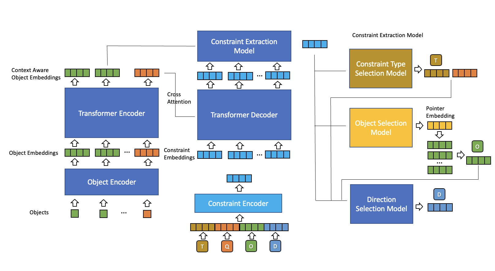

# Constraint Generation 

## Object Representation and Object Conversion Model 
Objects are represented by their bounding box as a tuple `(category, size, position, rotation)`. The Object Conversion Model should use learnable (or non learnable) embeddings for each of the tokens to create per object context vectors. 

Notes/Questions about getting the per object context embeddings 
 * Not sure whether to combine all of the embeddings by concatenation or addition. 
 * The `Structure Encoder` in [ATISS](https://nv-tlabs.github.io/ATISS/) has a positional encoding function for continuous values (orientation, size, and position). In [SceneFormer](https://arxiv.org/abs/2012.09793) these values are discretized and correspond with learnable embeddings. 
 * Not sure how to represent walls since size, position, and rotation are not really applicable -> perhaps a layout encoder to get a vector representation? [SceneFormer](https://arxiv.org/abs/2012.09793) does mention that walls are not included as objects because walls are assumed to be at the edges of the layout image 
 * Want to include `holds_humans` tag into the tuple representation, but not sure if this will already be learned by the category embedding implicitly, or if it's the appropriate place to add this tag 

## Constraint Sequence and Argument Selection Models 
Constraints are represented as tuples `(constraint type, object index, direction)`. Each of these tokens are generated autoregressively until the `stop` token is reached (only the constraint model can output a `stop` token). Both the Constraint Selection Model and the Direction Selection Model will have a final linear layer of `N` logits where `N` is the number of valid tokens for that type, since the number of valid tokens is fixed in both cases. In the case of orientation constraints, the direction selection model is skipped and the special token `e` (empty) is added to the final sequence. The Object Selection Model outputs a pointer embedding which will be compared to all of the valid context aware object embeddings with a dot product and softmax to choose the object index for that constraint. Valid object embeddings are chosen by constraint type. For example, the `reachable_by_arm` constraint will only be compared with objects which have a `holds_humans` tag. Both constraint and direction tokens use learnable embeddings. The object selection tokens use the context aware object embeddings. 

The sequence representation follows the same format as [SceneFormer](https://arxiv.org/abs/2012.09793) where there are multiple input sequences to the model corresponding to each of the token types being generated, and the corresponding embeddings for each sequence is added together. After each token generation, the corresponding sequence of that token type is shifted to the left so that the next model can condition on that token. For example, after the generation of token `C_2`, the constraint sequence is shifted to the left for the object selection model. 

I also considered just a single input sequence where each token generated is concatenated to the same sequence. 

## Constraint Sequence Ordering 
The list of constraints will be ordered `attach`, `reachable_by_arm`, `align`, and `face`. For constraints of the same type they will be ordered by object according to (a) the canonical ordering according to average size and frequency in the dataset (b) the size of the object (biggest to largest) if two objects of the same category exist for that constraint type. For location constraints of both the same type and object, constraints are ordered by direction going `right`, `top`, `left`, `bottom`. 

