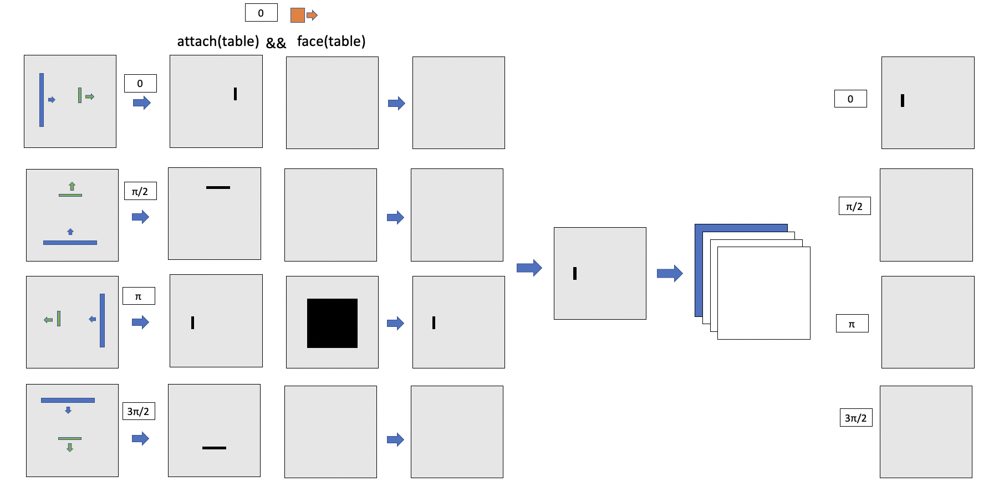
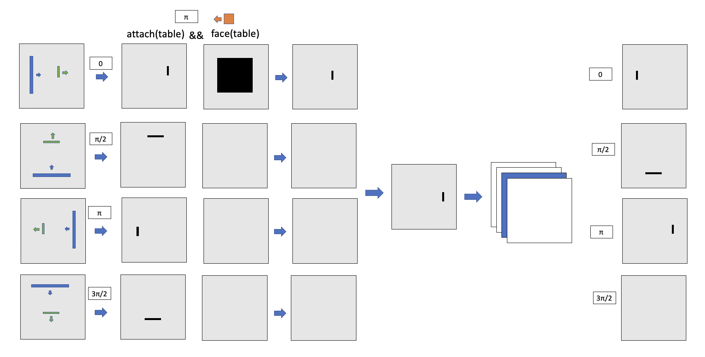

# 7/1/22 - Data Structure Update
[Conventions and definitions](../6%3A30%3A22/orientation.md) are the same, but here are a few more definitions that build upon the previous ones, and a new procedure for evaluation. Shown in this document are the same examples except with the new procedure and definitions 

The only instantiated variables in the language are `masks`. Masks are represented as a 3D array of `shape = (num_angles, dimension, dimension)`. 

Syntax 
 * `mask = constraint operator constraint`
    * Details below
    * This could also take the form of `(constraint operator constraint operator, constraint ...)` but I think that is unnecessary
 * `mask = mask operator mask`
    * Simple CSG 
 * `mask = macro(mask)`
    * For methods that involve non CSG operations (ensuring no placement generates collision, ensuring walkability in the room)

 ## Mask generation
`constraint operator constraint`

Each 2D location slice of `shape = (dimension, dimension)` in the final mask corresponds to a possible orientation of the object. For each possible orientation `a_o`, evaluate the two constraints and the operator to produce a single 2D slice. Evaluation of the constraints involves solving the constraint given the object orientation `a_o` for each possible direction objects face in the room. The masks for each constraint is then combined with the operator and finally unioned together to produce the final output slice. 

**Note:** If we impose another restriction on the syntax of mask generation stating that one constraint must be a location constraint and one must be an orientation constraint and have the operator always be an intersection, then we can do Kai's little optimization trick of not even computing the mask for invalid orientations and only compute the location constraint for the valid angles. 

## Reading Diagrams
### Left side
The left side shows the process for generating the 2D location slice. Each row labelled with angle `a_r` corresponds with which faces of objects in the room have normals at an angle `a_r` from `[1, 0]` in the room. Column 1 shows the room encoding. Column 2 shows solving for the first constraint, and Column 3 solving for second constraint. Column 4 shows the result of applying the operator row wise to each of the 2D slices resulting from the constraint solving. The angle value at the top represents the assumed orientation of the object when solving the constraints. 

### Right side 
The right side shows the generated mask. Each row corresponds to the angle of rotation of the object itself. The highlighted 2D slice in the 3D mask corresponds with the assumed angle from the left side of the diagram. 

## Clarification on solving the orientation constraints
`object_to_place` is given and so is its orientation 

`object` is the argument to the orientation is constraint

For every possible angle `a_r` from `[1, 0]` 
 * Check if `object` has a semantic front that points at an angle `a_r` from `[1, 0]`
    * Yes: If the semantic front of `object_to_place` points in the same (opposite for `face`) direction of `[1,0]` rotated by `a_r` CCW, consider this angle `a_r` as a valid orientation for placement and mask all possible locations. 
    * No: If the semantic `object_to_place` points in the same (opposite for `face`) direction as the semantic front of `object`, consider this angle `a_r` as a valid orientation for placement and mask all possible locations. 
        * This is done to account for the case that an object's location may be attached to a face that is not a semantic front. 

# Revisiting previous situations with new method
## Attach wardrobe to wall
### Setup 1
Wardrobe with semantic front in direction `[1, 0]`
```
attach(wall) && align(wall)
```


### Masks


### Setup 2
Wardrobe with semantic front in direction `[0, -1]`
```
attach(wall) && align(wall)
```


### Masks


## Place chair at table
### Setup 
```
attach(table) && face(table)
```


### Masks






## Place nightstand by bed
The only masks shown for this case is when the object has rotation $3\pi / 2$ because it is the only case where non empty masks are generated and written to the final mask. In all other cases of possible object orientations, the orientation mask is empty. 


## Place chair in living room context 
### Setup 
```
option_1 = reachable_by_arm(sofa, LEFT | RIGHT) && face(cabinet)
option_2 = walkable_between(table, LEFT | RIGHT) && face(table)
option_3 = walkable_between(table, LEFT | RIGHT) && face(cabinet)
final_mask = option_1 || option_2 || option_3
```


### Masks 
#### Read the diagram shorthand 

