# 7/7/22 Code Update
Shown is the implementation of the language redesign and the new datastructure. The examples shown largely follow the handdrawn diagrams of the last [udpate](../7%3A1%3A22/orientation_update.md). 

All images are 256 x 256
## Reading diagrams
**Note:** Apologies on how small the encoding display is in the visualization 

I've decided to present everything in a horizontal format. Now each column represents a different bin of angular histogram (if 5 columns are present, the leftmost is the full room encoding). Left to right is in increasing value of the angle. Rows represent each different mask. For the larger diagrams, the rows are as follows 
 * constraint 1
 * constraint 2
 * mask after operator applied to both 
 * collapsed final mask 

For room encodings that display the current objects in the room, the color coding is as follows. 
 * `walls - black`
 * `bed - blue`
 * `cabinet/shelf/desk - red`
 * `light - yellow`
 * `semantic front - green`

# Examples
## Attach wardrobe to wall
Room layout and encoding (thin black line is the wall)

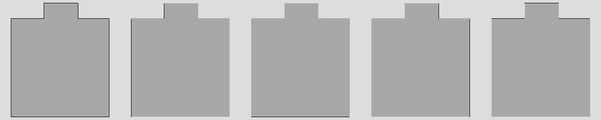

Wardrobe semantic front pointing in direction `[0,0,1]`

Program 
```
attach(wall) && align(wall)
```

Constraint solve

Possible object orientation = `0`

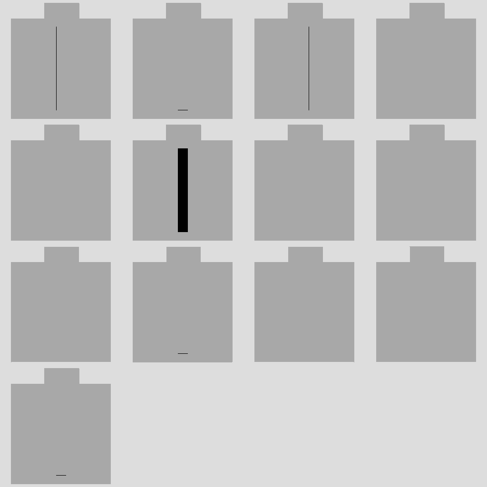

Possible object orientation = `pi/2`

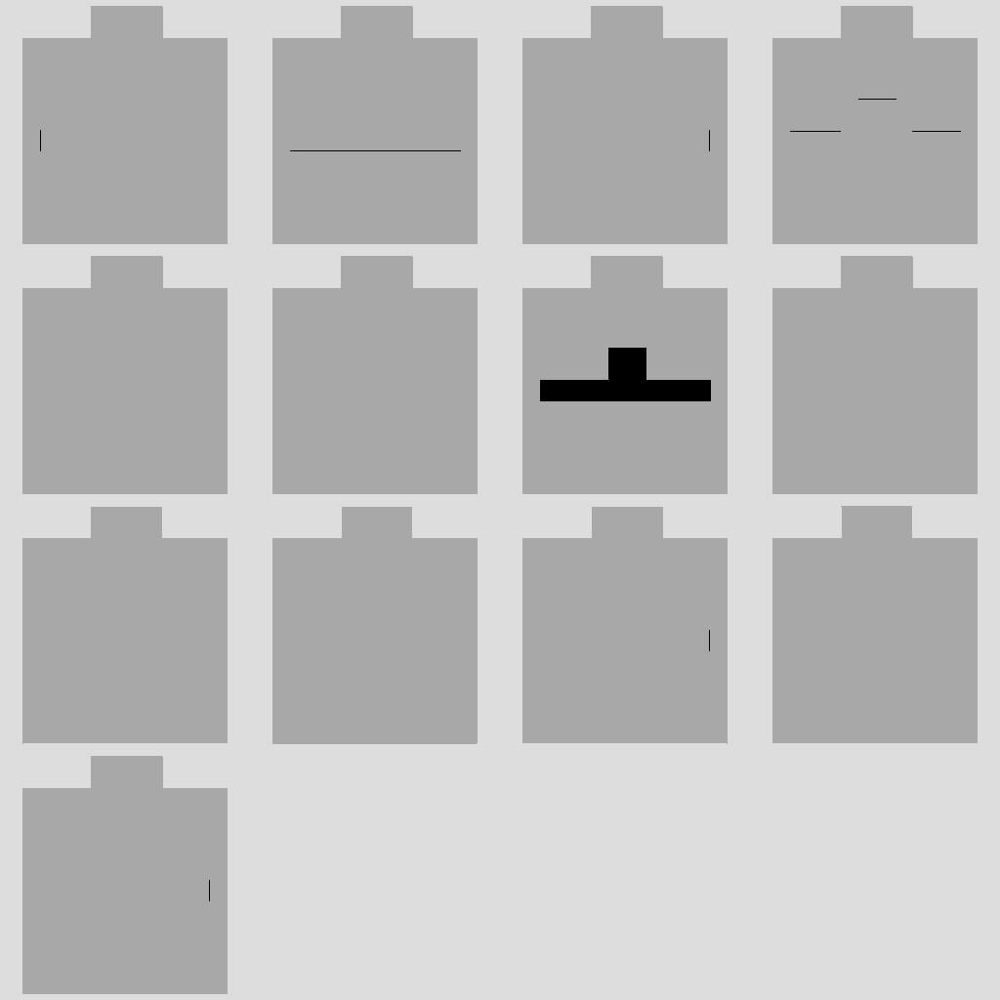

Possible object orientation = `pi`

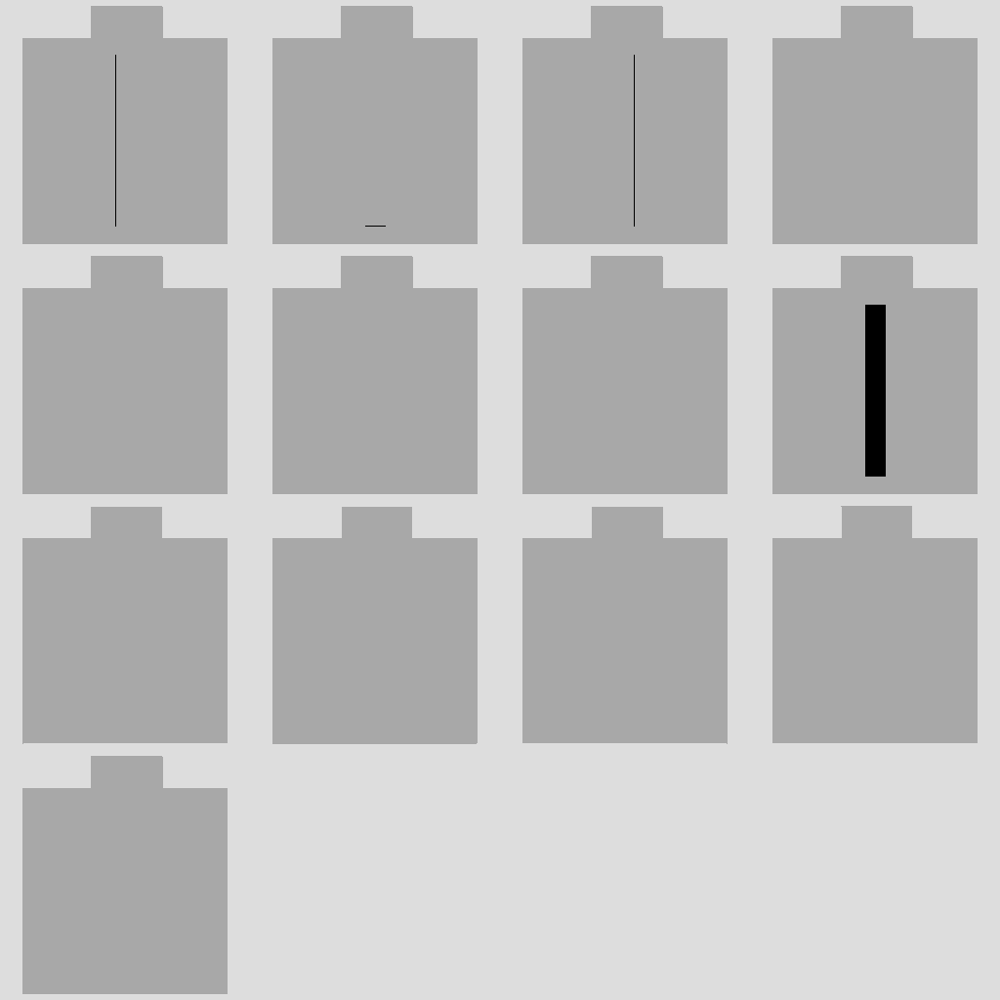

Possible object orientation = `3pi/2`

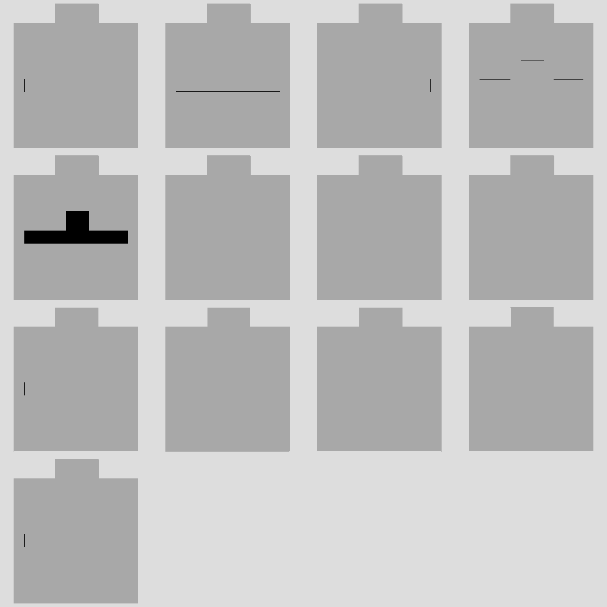

Final mask

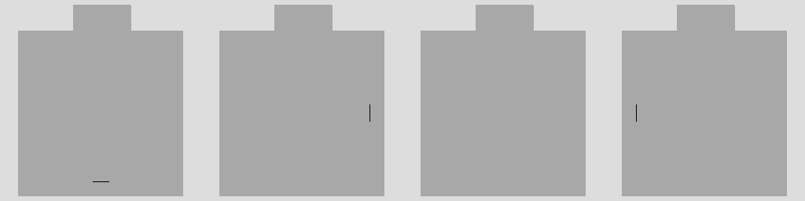

Some samples with semantic front shown in green


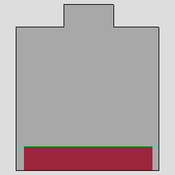
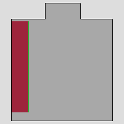


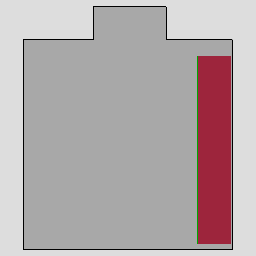
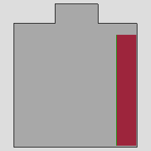
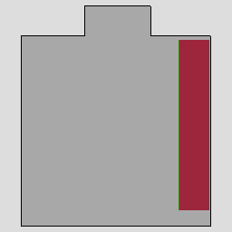
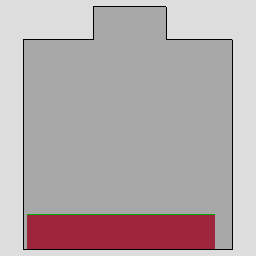

## Attach chair to table 
Room layout and encoding

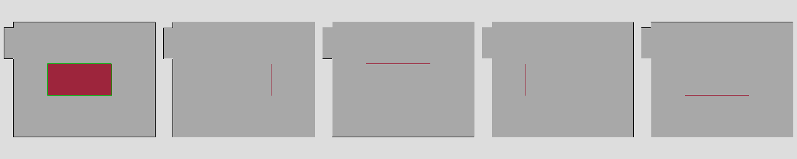

Chair semantic front pointing in direction `[1,0,0]`

Program 
```
attach(table) && face(table)
```

Constraint solve

Possible object orientation = `0`

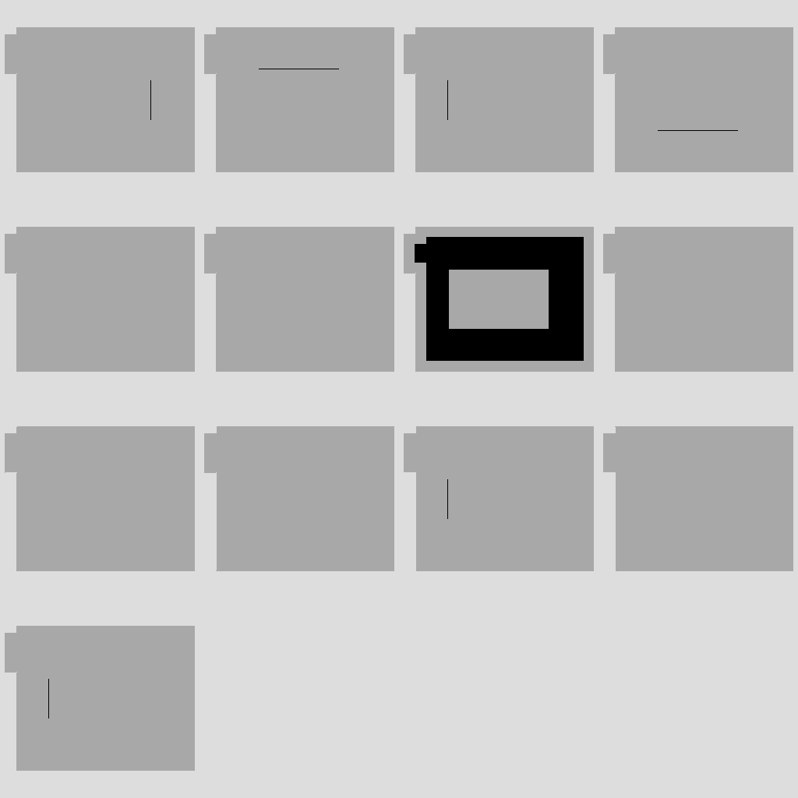

Possible object orientation = `pi/2`

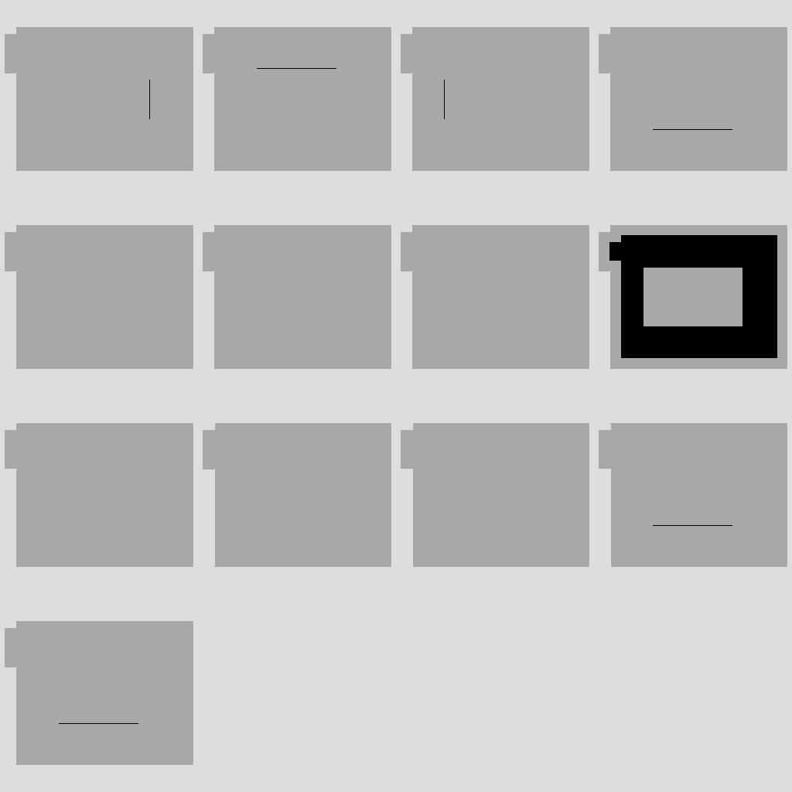

Possible object orientation = `pi`

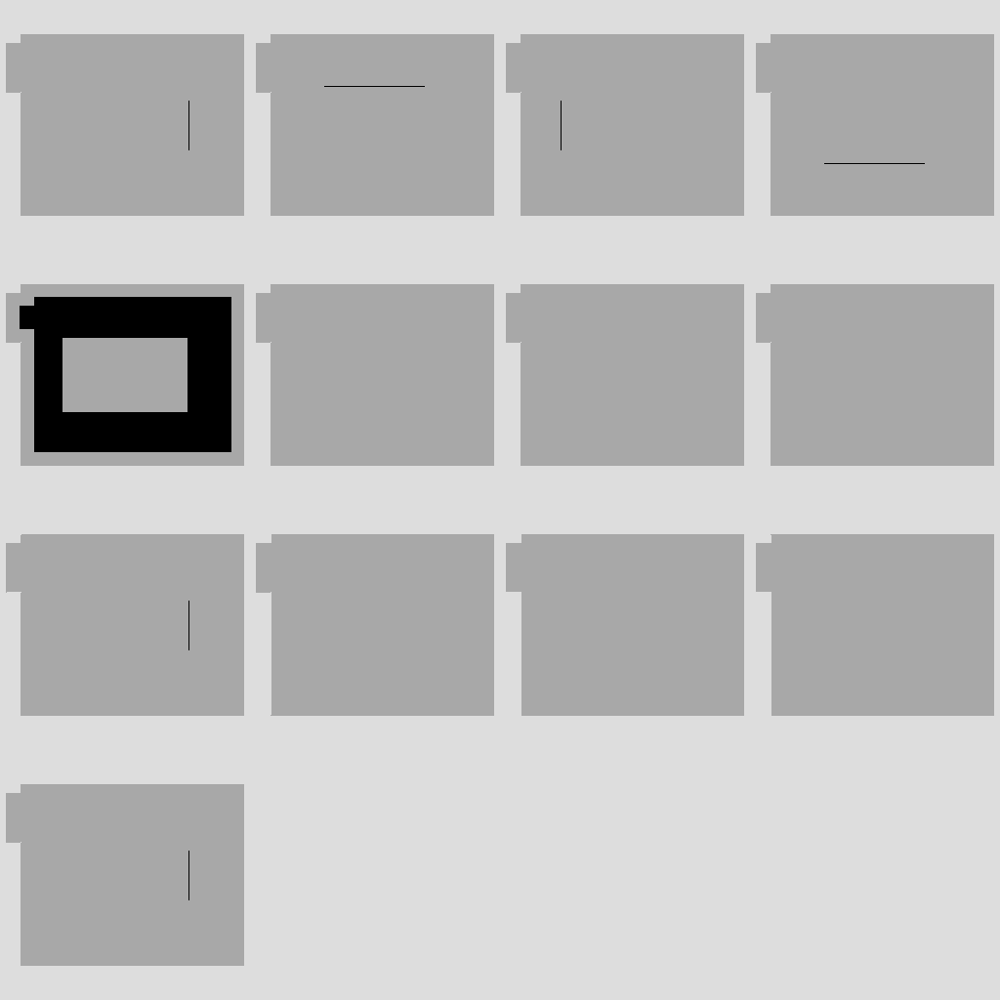

Possible object orientation = `3pi/2`

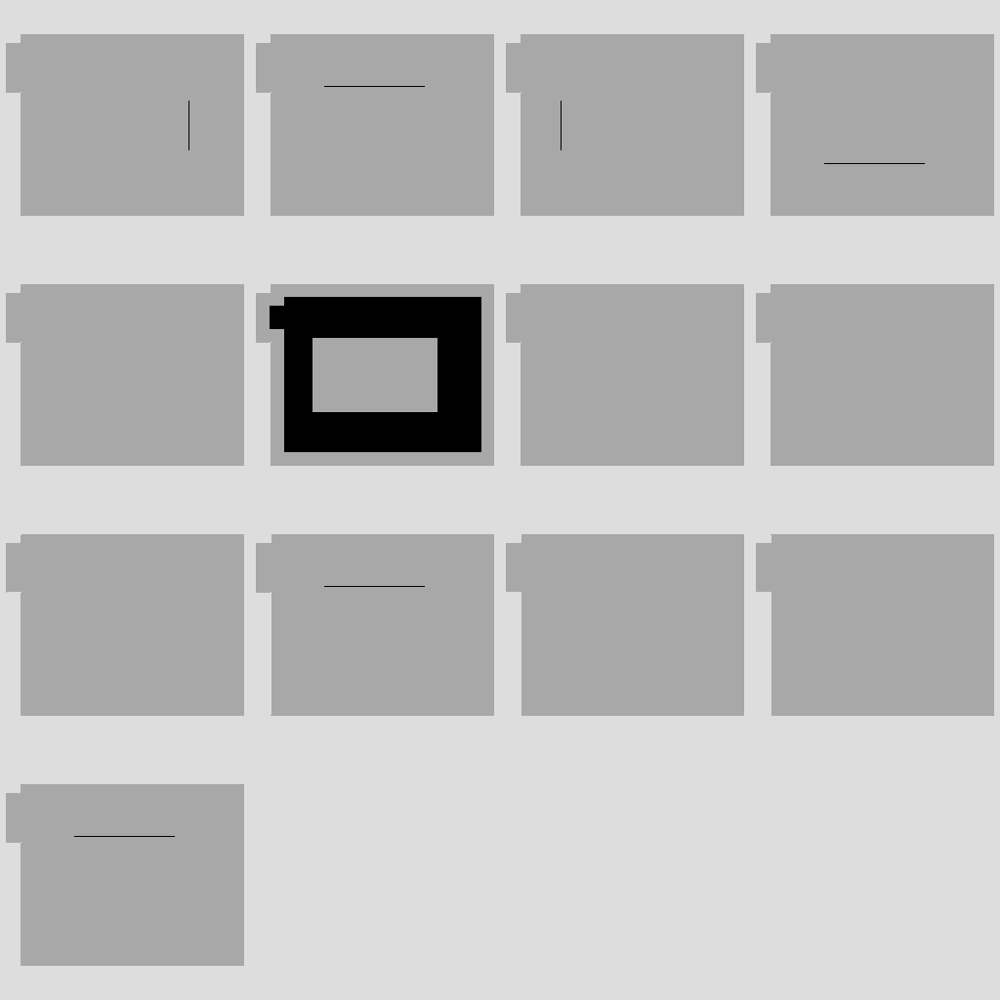

Final mask 

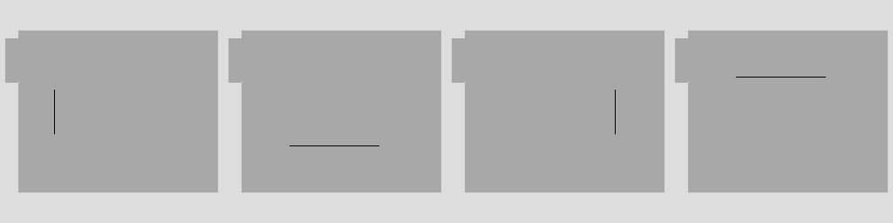

## Attach nightstand to bed 
Room layout and encoding

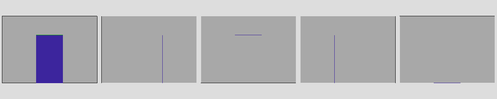

Nightstand semantic front pointing in direction `[1,0,0]`

Program 
```
reachable_by_arm(bed, LEFT | RIGHT) && align(bed)
```

Constraint solve

Possible object orientation = `0`


Possible object orientation = `pi/2`


Possible object orientation = `pi`


Possible object orientation = `3pi/2`

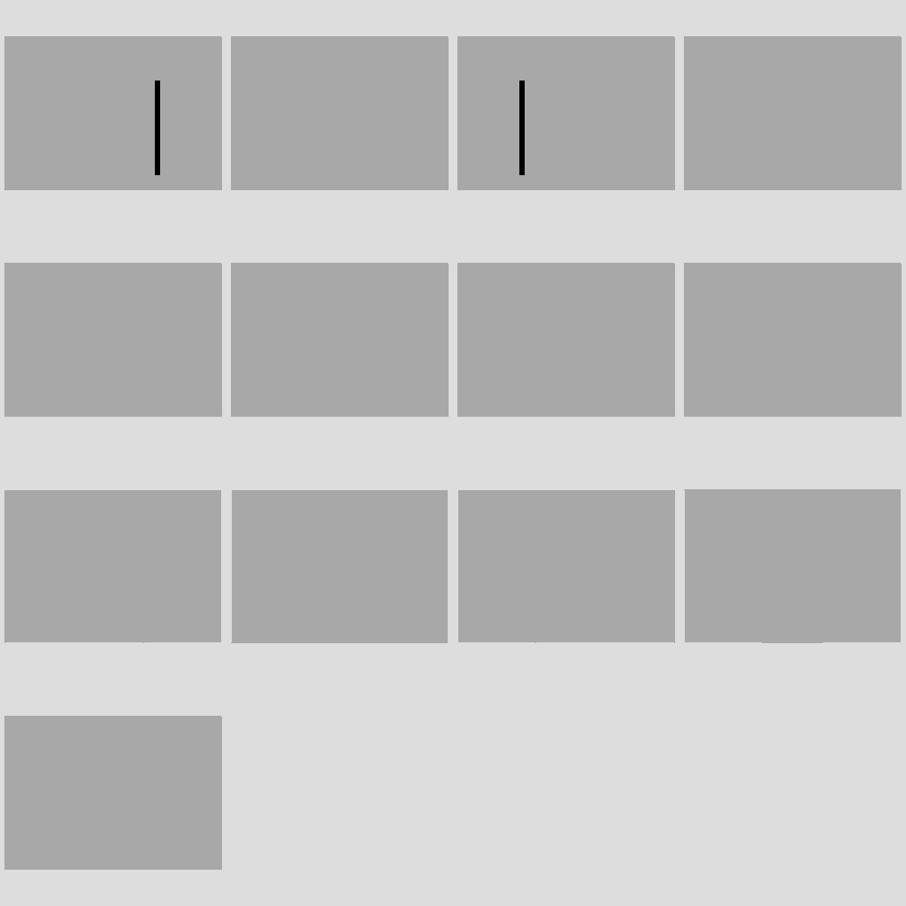

Final mask 

