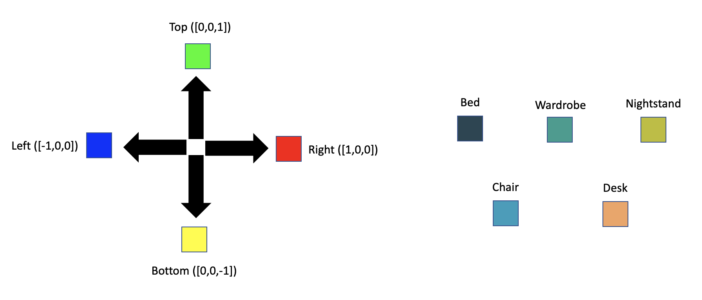
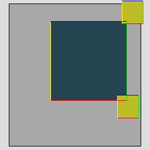
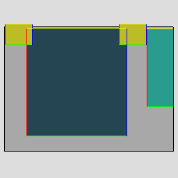
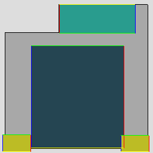
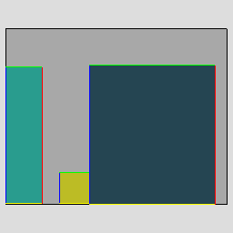
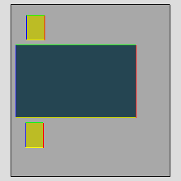
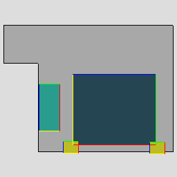
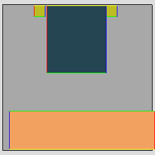

# Program Exraction
## Slack Review 
**Abbreivated Version of Daniel's Original Post**

Rather than devising a procedure up-front for extracting programs from scenes to create the ‘optimal’ program for each object insertion task (i.e. not overly specific, not overly general), we should (a) write a naive procedure for extracting programs from scenes (For the object to be inserted, create the program which consists of all possible constraints which could apply) and (b) try training a neural network to generate these programs. It seems premature to do any kind of pattern analysis to pre-process the training data before seeing how a network behaves when trained on naive programs. 

If designed appropriately, the network should be able to generalize somewhat and produce programs which are more general than the training data. From Kai’s prior work, we know that networks can do some of this kind of generalization if they’re sufficiently regularized. So it will be interesting to see what sort of generalization behavior we observe when we switch from trying to predict a continuous distribution of possible placement locations to predicting a discrete program. Based on what behavior we see here, we may then decide we need to do some further pattern analysis as a pre-process for the training data. 

### Neural Network 
**Daniel:** I think it makes sense to to treat this as a sequence-to-sequence (or rather, a ‘set to set’) translation problem: we have a transformer encoder that computes context-aware representations of each object in the scene (where objects include wall segments, doors, etc.), and then a decoder that produces the set of constraints. We might get some inspiration from this recent work, which also learns to generate sets of constraints that describe layouts: https://arxiv.org/pdf/2011.13417.pdf

**Kai:** If I understand it correctly: the main idea we want to take from this paper is the "generating constraints" parts and, to a lesser degree, the idea that we can leave some of the work to an optimization process. For pointer networks: if you know what attention is, think about it as attention, but instead of using attention to generate embeddings, you use the dot product attention directly to figure out some discrete problems e.g. connecting edges. But connecting edges isn't necessarily the only thing that can be done here - figuring out the anchors for our relation formulation is also one way it can be used, i think.

**Daniel:** The main thing I was hoping you’d take away from this paper is “some neural network architecture ideas for how to generate a set of elements which have references to other elements.” Our programs consist of constraint/functions, and those functions have arguments that refer to objects in the current partial scene. So, you could imagine using a transformer to generate the set of functions, and then using a pointer network to generate the arguments (i.e. figuring out which objects in the partial scene each argument should point to)

### Refining the 'ground truth' programs 
**Daniel:** I had an idea for trying to find ‘the right’ program for an object insertion task, given multiple candidate programs (e.g. trying to figure out which constraints should be included out of all possible constraints, or even trying to figure out which sample from a generative model of programs is the best). We could take the program, generate a bunch of object placements according to it, and then try to assess how well those samples match what’s in our dataset. Ideally we’d pick the program such that (a) all of its samples look like they come from the same distribution as the dataset, and (b) the samples have high internal diversity (i.e. we’re not just generating the same placement over and over again). (a) and (b) can be in conflict, so there’s some choice of hyperparameter to trade off how much we care about one versus the other.

## Designing the Naive Program 
For now, only deal with the object categories `{wardrobe, bed, nightstand, desk, chair}`

Available syntax and constraints
Syntax
 * `mask = location_constraint operator orientation_constraint`
 * `mask = mask operator mask`

Implemented location constraints 
 * `attach(Object, Directions)`
 * `reachable_by_arm(Object, Directions)`

Implemented orientation constraints 
 * `align(Object)`
 * `face(Object)`

### Naive Procedure 
For every object category and for every room with at least one instance of this object category: 

Infer every possible location constraint by looking at what other objects are in close proximity to an object with this category. If there are multiple instances of objects with this category in the room, produce location constraints for each one. For each possible location constraint, pair it with an orientation constraint referring to the same object and infer whether to use `align` or `face` by object category. 

Note

 
Employing this restriction introduces an inductive bias that the orientation of an object is/can only be specified in relation to objects that are close in proximity to it. My reasoning for doing this (for now at least) is that objects do not have labelled semantic fronts (for now). It makes more sense to me to try and extract possible orientation constraints based on geometric heuristics when the world space semantic fronts of all the objects are known. Trying to extract orientation constraints from all other objects in the room with only category will (IMO) result in more spurious constraints than ones that actually carry more semantic meaning/may represent a general design principle of the dataset. Also it might make more sense to predict an orientation constraint after a location constraint. 

For every object in local vicinity to the current held out object - try and produce a location mask in every possible direction relative to the close object. If the held out object looks like it could possibly come from that mask, mark that location constraint as valid. If the held out object is inside the bounding box of another object -> blah 

Another option for deciding what exact relative directions should be given is to get the world space direction, and then based on the non held out object's rotation convert this direction to object space. 

**Intermediate update (7/13/22)** 

Note

 
I have not tried extracting the program yet, this is me just hypothesizing looking at the given bedrooms and their objects. 

I think the way directions are specified for location constraints need to change. I think that they need to be given in terms of semantic fronts. 

Color key for all diagrams below. The colors shown on the diagrams are in the coordinate frames of their respective objects. 

In most cases, nighstands appear on the `right` side and `left` side of the bed. 

But there are also significant number of rooms where are nightstands appear on the `top` and `bottom` sides of the bed. I'm guessing that this is because beds need not be given in some kind of aligned canonical direction, so semantically the sides that `right`, `left`, `top`, and `bottom` all refer to are devoid of semantic meaning. 

Generating the superset of location constraints that could apply to placing a nighstand would probably appear to be something like `attach(bed, RIGHT | LEFT| TOP | BOTTOM), reachable_by_arm(bed, RIGHT | LEFT| TOP | BOTTOM)` + some constraints relating to other objects. Results like that make some sense to me. I can see nightstands appearing at the foot of a bed and maybe to a lesser degree at the head of the bed. The key thing that I think would invalidate this kind of result is that those constraints didn't appear because a nighstand appeared at the foot of the bed or at the head of the bed. Those constraints appeared because the way directions are specified for location constraints aren't dependent on the semantic fronts of objects. 