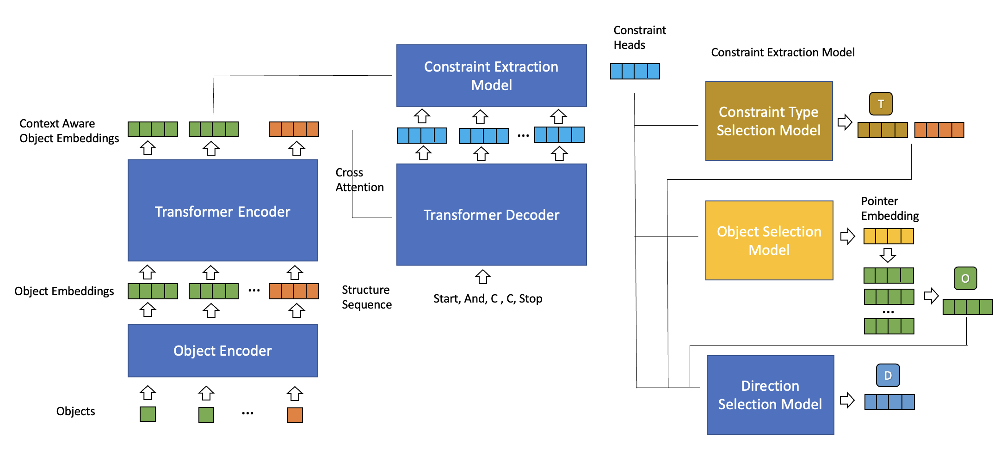

# Syntax Revision 
There are now two token sequences associated with each program. There is a structure sequence and there is a constraint sequence. 

Structure sequence vocab 
 * `c` : indicates the existence of a constraint
 * `or` : indicates the start of an expression. two full expressions expected after 
 * `and` : indicates the start of an expression. two full expressions expected after 
 * `sos` : start of sequence 
 * `eos` : end of sequence 
 * `<pad>` : padding for batching 

A full expression is a sequence of tokens that can be executed in isolation. Examples: 
 * `c`
 * `or c c`
 * `or and c c and c c`

## Example programs 
### Ex 1
Input object sequence 
```
(bed query object)
[wall, bed] 
```

Target Sequences 
For humans 👨
```
attach(bed, wall, all) && align(bed, wall)
```

For computer 🖥️
```
sos and c c

attach(bed, wall, all) -> [0, 1, 0, 4]
align(bed, wall, all) -> [3, 1, 0, 4]
```

### Ex 2
Input object sequence
```
(chair query object)
[wall, sofa, table, cabinet, chair]
```

Target Sequences 
For humans 👨
```
mask1 = reachable_by_arm(chair, sofa, LEFT) || reachable_by_arm(chair, sofa, RIGHT)
mask2 = walkable_between(chair, table, LEFT) || walkable_between(chair, table, RIGHT)
mask3 = mask1 || mask2
mask4 = mask3 and face(cabinet)

return mask4
```

For computer 🖥️
```
structure sequence 
sos and or or c c or c c c eos 
// Easier on the eyes
{and [or (or c c) (or c c)] c}

reachable_by_arm(chair, sofa, LEFT) -> [1, 4, 1, 2]
reachable_by_arm(chair, sofa, RIGHT) -> [1, 4, 1, 0]
walkable_between(chair, table, LEFT) -> [2, 4, 2, 2]
walkable_between(chair, table, RIGHT) -> [2, 4, 2, 0]
face(chair, cabinet) -> [4, 4, 3, 4]
```

# Network Revision
The input to the decoder is now just a structure sequence. Each of the heads associated with a constraint token are fed to the constraint decoder to get the constraint arguments. 

