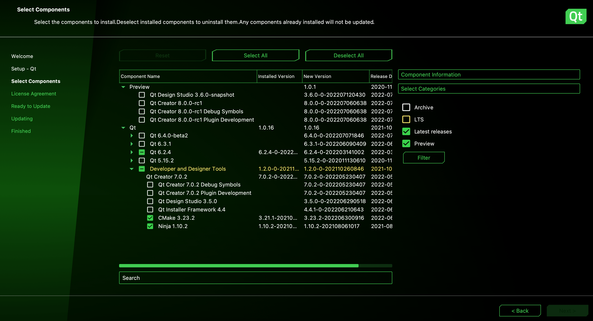

# Get started with CMake 
Make sure that Qt has both `CMake` and `Ninja` installed as tools. In the graphic installer, it looks like this. 



Already installed Qt, but didn't include these tools during your installation? Go to your installation directory of Qt and run `MaintenanceTool`. This will get you to the graphical installer where you can add `CMake` and `Ninja`. 

## CMake in QtCreator 
If you successfully installed `CMake` and `Ninja` through the graphical installer, no further setup in QtCreator should be required as the kit is already detected and its flags already set. If there is an installation issue, consult this [doc](https://doc.qt.io/qtcreator/creator-project-cmake.html) and this [doc](https://doc.qt.io/qtcreator/creator-build-settings-cmake.html). 

### Adding files to a CMake project in QtCreator
Unfortunately, right clicking on the project name and going through the add new file dialog will only write to disk. It will not automatically write to `CMakeLists.txt`. You will have to manually add the file names to the `add_executable` option in `CMakeLists.txt`. More on this below. 

## QMake to CMake conversion 
QMake uses `.pro` files to compile projects but CMake uses `CMakeLists.txt` to compile projects. This means that your qmake projects will need to be converted to cmake projects by creating a `CMakeLists.txt` file to replace your `.pro` file. 

Generally `CMakeLists.txt` will follow this format 
```
cmake_minimum_required(VERSION 3.16)

project(project_name LANGUAGES CXX)

set(CMAKE_INCLUDE_CURRENT_DIR ON)

set(CMAKE_AUTOUIC ON)
set(CMAKE_AUTOMOC ON)
set(CMAKE_AUTORCC ON)

set(CMAKE_CXX_STANDARD 20)
set(CMAKE_CXX_STANDARD_REQUIRED ON)

# Edit from this point onwards 

find_package(Qt6 COMPONENTS Core)
find_package(Qt6 COMPONENTS Gui)
find_package(Qt6 COMPONENTS OpenGL)
find_package(Qt6 COMPONENTS Widgets)
find_package(glm)

add_executable(project_name
  main.cpp 
  header_file_1.h code_file_1.cpp
  header_file_2.h code_file_2.cpp
)

target_link_libraries(project_name PUBLIC
    Qt::Core
    Qt::Gui
    Qt::OpenGL
    Qt::Widgets
)
```
**Note:** many references to `Qt` can also be replaced by `Qt${QT_VERSION_MAJOR}` for more specificity. e.g. `Qt${QT_VERSION_MAJOR}::Core`

The main things you will have to edit are
 * `find_package` - The project includes external libraries with this command. This also refers to Qt packages such as `Gui` or `OpenGL`. Use this command to include libraries in your project. 
    * ex: `find_package(Qt6 COMPONENTS Core)`
    * This [repo](https://github.com/g-truc/glm) contains a folder `glm`. Placing this folder in the same directory as CMakeLists.txt with `find_package(glm)` in `CMakeLists.txt` should give the project access to the `glm` library. 
 * `add_executable` must have all the `.h` and `.cpp` files in the project included. QtCreator will also not see files not included in this. 
 * `target_link_libraries` links the project with the installed QtLibraries so that `find_package` knows where to look
    * ex: `target_link_libraries(project_name PUBLIC Qt::Core)`

### Example conversion 
[reference](https://code.qt.io/cgit/qt/qtbase.git/tree/examples/opengl/2dpainting?h=6.2)

`.pro file`
```
QT += widgets opengl openglwidgets

HEADERS     = glwidget.h \
              helper.h \
              widget.h \
              window.h
SOURCES     = glwidget.cpp \
              helper.cpp \
              main.cpp \
              widget.cpp \
              window.cpp

# install
target.path = $$[QT_INSTALL_EXAMPLES]/opengl/2dpainting
INSTALLS += target

```

`CMakeLists.txt`
```
cmake_minimum_required(VERSION 3.16)
project(2dpainting LANGUAGES CXX)

set(CMAKE_INCLUDE_CURRENT_DIR ON)

set(CMAKE_AUTOMOC ON)
set(CMAKE_AUTORCC ON)
set(CMAKE_AUTOUIC ON)

if(NOT DEFINED INSTALL_EXAMPLESDIR)
  set(INSTALL_EXAMPLESDIR "examples")
endif()

set(INSTALL_EXAMPLEDIR "${INSTALL_EXAMPLESDIR}/opengl/2dpainting")

find_package(Qt6 COMPONENTS Core)
find_package(Qt6 COMPONENTS Gui)
find_package(Qt6 COMPONENTS Widgets)
find_package(Qt6 COMPONENTS OpenGL)
find_package(Qt6 COMPONENTS OpenGLWidgets)

qt_add_executable(2dpainting
    glwidget.cpp glwidget.h
    helper.cpp helper.h
    main.cpp
    widget.cpp widget.h
    window.cpp window.h
)
set_target_properties(2dpainting PROPERTIES
    WIN32_EXECUTABLE TRUE
    MACOSX_BUNDLE TRUE
)
target_link_libraries(2dpainting PUBLIC
    Qt::Core
    Qt::Gui
    Qt::OpenGL
    Qt::OpenGLWidgets
    Qt::Widgets
)

install(TARGETS 2dpainting
    RUNTIME DESTINATION "${INSTALL_EXAMPLEDIR}"
    BUNDLE DESTINATION "${INSTALL_EXAMPLEDIR}"
    LIBRARY DESTINATION "${INSTALL_EXAMPLEDIR}"
)
```

## Qt Examples Folder
There is a high chance that this minimalist version of `CMakeLists.txt` is not enough to successfully build the project. In those cases consider consulting example projects that Qt has distributed. In your installation folder of Qt there should be a folder `Examples` which contains source code and more importantly `.pro` and `CMakeLists.txt` files for most aspects of Qt. A link to those examples are also available [here](https://code.qt.io/cgit/qt/qtbase.git/tree/examples?h=6.2). 
