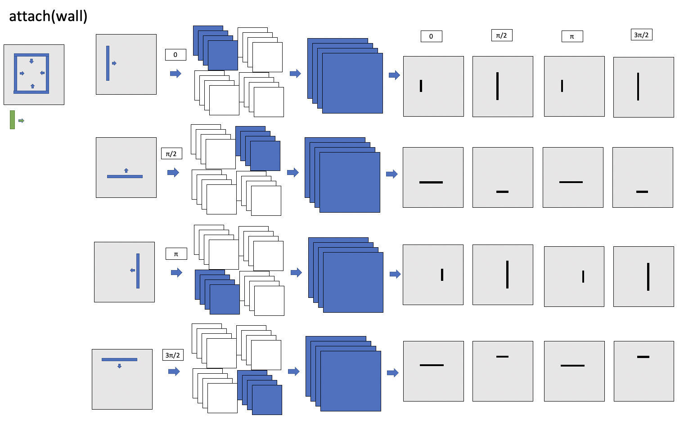
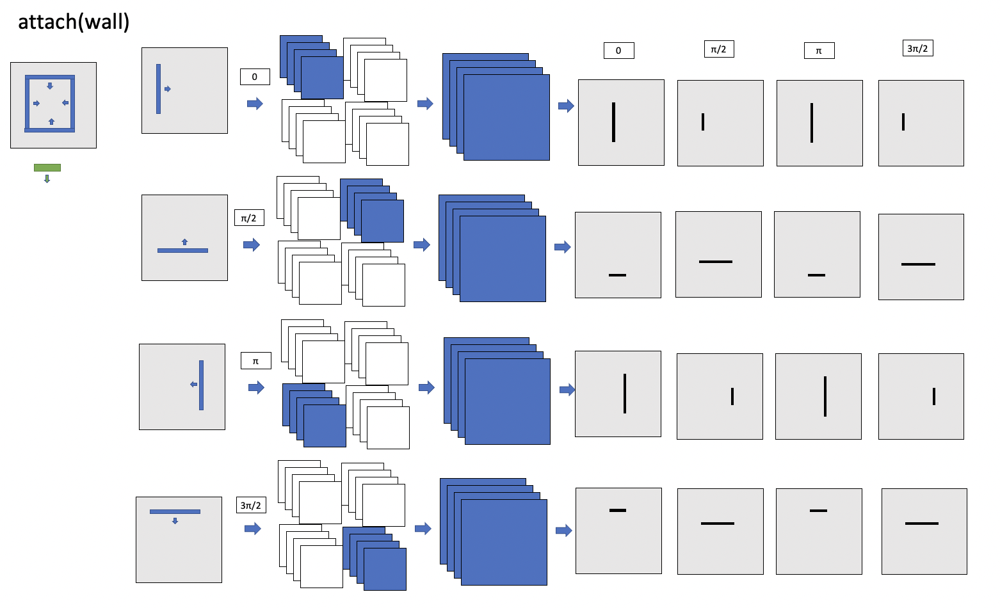

# Data Structure Update
## Conventions and definitions
The following sections walk through different program examples and gives visualizations of what the datastructure should look like at every step of each example program. In all examples, including when the datastructure is a 4D tensor, the following conventions and definitions are used. 

### Room encoding
Walls and object faces are binned according to the angle of rotation from `[1, 0]`. The angular domain is discretized into a histogram of 4 bins, each of width $\pi / 2$. Angles of rotation are considered CCW. For example, the following room is encoded as such. Space outside the room is masked out, but this is not shown in the diagram and any of the following diagrams. 

Wall normals always point towards the insider of the room
### Data Structure Definition
`num_angles = 4` for now

`dimension` is the number of cells to discretize the spatial domain by. 
* 3D data structure is an array of `shape = (num_angles, dimension, dimension)`

* 4D data structure is an array of `shape = (num_angles, num_angles dimension, dimension)` 

### Grammar with Independence Assumption
The object to place is omitted from the grammar because it is already assumed that it is the only object to consider placing, so there is only one option for that argument 

#### Location Constraints
Constraints that constrain only the location of the object and considers all possible orientations as valid. 
* `attach(Object, Directions)` - For all possible orientations and in the given spatial directions around the object, constrain the location such that the two objects are physically attached
* `reachable_by_arm(Object, Directions)` - For all possible orientations and in the given spatial directions around the object, constrain the location such that the two objects are within (human) reachable distance to each other 
* `walkable_between(Object, Directions)` - For all possible orientations and in the given spatial directions around the object, constrain the location such that the two objects have walkable space between them 

#### Orientation Constraints
Constraints that constrain only the orientation of the object and considers all possible locations as valid. 
* `align(Object)` - For all possible locations, constrain the possible orientations of the object to place such that the semantic front(s) of both objects face the same direction. 
* `face(Object)` - For all possible locations, constrain the possible orientations of the object to place such that the semantic front(s) of both objects face each other 

## Attach wardrobe to wall
In this example, masks are visualized in the following scenarios. 

1. Scenario 1 uses the original grammar which jointly considers both the orientation of the object and its location when choosing its possible locations. Consider this the starting point of working through the mechanisms of adding this orientation axis. 
 * Program: `attach(wardrobe, wall)`
 * 3D data structure 
 * wardrobe semantic front: `[1, 0]`

2. Scenario 2 shows the issues that arise when modeling the orientation and location of an object independently with a 3D datastructure that has only one axis for the angle of rotation of the object to place. 
 * Program: `attach(wall) && align(wall)`
 * 3D data structure
 * wardrobe semantic front: `[1, 0]`

3. Scenario 3 shows why a 4D datastructure is necessary to accurately model the location and orientation of an object independently. It also shows the mechanisms of this 4D data structure. 
 * Program: `attach(wall) && align(wall)`
 * 4D data structure
 * wardrobe semantic front: `[1, 0]`

4. Scenario 4 shows that the data structure is invariant to the rotation of the object's semantic front. It does not matter what direction(s) the semantic front(s) of the object point in. (This is true for the 3D datastructure, but a direct example of this is not shown)
 * Program: `attach(wall) && align(wall)`
 * 4D data structure
 * wardrobe semantic front: `[0, -1]`

### Scenario 1

For every possible angle $\alpha_w$, calculate the (CCW) angle $\alpha_o$ required to rotate object such that its semantic front is aligned with the wall. Use this rotated object and the wall with surface normal $\alpha_w$ from `[1, 0]` to predict the location. Place these predicted locations in the slice at $\alpha_o$. 

### Scenario 2

For every possible angle $\alpha_w$, consider every possible orientation of the object $\alpha_o$ and constrain the location of the object so that the object is attached to the wall. 

For every possible angle $\alpha_w$, calculate the angle $\alpha_o$ required to rotate the object so that its semantic front is aligned with the wall, and record all valid placements for the given object. 

Find the intersection between the two masks. There seems to be a problem with our data structure and/or process as the final mask does not make sense. The process would look more correct if the output masks at each step were not accumulated together but kept seperate. For example, in the case of producing the `attach` mask, the results at each step of considering $\alpha_w$ should not accumulate. This is the motivation behind adding another dimension to the datastructure. 

### Scenario 3

Repeat the same process of attachment as scenario 2 attachment, except write the results into the 3D data structure at $\alpha_w$ in our 4D datastructure. 

Repeat the same process of attachment as scenario 2 alignment, except write the results into the 3D data structure at $\alpha_w$ in our 4D datastructure. 

The 4D datastructure is collapsed into a 3D one columnwise by finding the union of each of the individual masks together. The final output mask looks correct now. 

All following examples do not show this process with the 3D datastructure and assumes independence of predicting location and orientation. 

### Scenario 4
The following repeats the same process as (#3) but gives the wardobe's semantic front as `[0, -1]`. This is to show that the semantic front need not be given in a canonical and standardized direction (when there is only 1). This scenario is also shown to hint at what the masks look like in the case of objects with multiple semantic fronts. 

## Place chair at table

## Place nightstand by bed

## Place chair in living room context